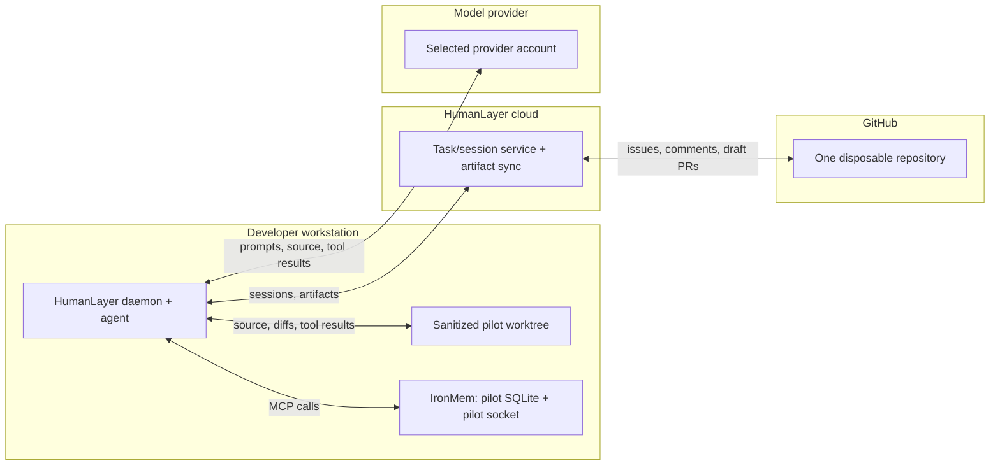

# HumanLayer Pilot Threat Model

**Review date:** 2026-08-19
**Scope:** HumanLayer evaluation for issues [#304](https://github.com/ironrace/ironmem/issues/304) and [#311](https://github.com/ironrace/ironmem/issues/311). This is the authoritative security gate for this pilot.

**Evidence basis.** Facts below were checked against linked primary documentation, npm registry metadata, and this repository at the review date. "Fact" means the source says it; "inference" is a conclusion drawn from facts; "unknown" is deliberately not filled in by marketing copy or a generic privacy policy.

## Executive decision

**A narrow pilot is PERMITTED** once the five mandatory controls below are in place: one disposable GitHub repository containing only public or synthetic material, on the existing developer workstation, producing draft pull requests only.

**tenfourpro and every other private, customer-data, production-connected, or secret-bearing repository is PROHIBITED** for this pilot. That prohibition rests on a concrete, checkable fact: those checkouts hold live provider credentials and production database URLs, and HumanLayer's workspace defaults copy `.env` files into generated worktrees.

**Broader rollout remains BLOCKED** pending the vendor evidence in "Open questions." Broader rollout means additional repositories, private material, or removal of the draft-only constraint.

## Proportionality anchor

Controls in this document are justified against **what this host already accepts**, not against an absolute standard.

Claude Code and Codex already run on this workstation as this OS user, with this user's filesystem authority, network access, shell environment, GitHub credentials, and `.env` files, against production repositories. That is the established baseline. Re-deriving it as a HumanLayer finding is out of scope: any control that would equally prohibit the tools already in daily use is not a HumanLayer risk and does not belong here.

This threat model therefore addresses only what HumanLayer **adds** to that baseline:

1. Task, session, and artifact data synchronizing to a vendor cloud.
2. A GitHub App holding contents, issues, and pull-request write access.
3. Automatic workspace setup that copies files — including `.env` — into generated worktrees, via `copyGlobs` that append and cannot be subtracted.
4. A `setupCommand` that executes as `sh -c` after those copies.
5. An additional vendor in the supply chain and in the data path.

Everything below follows from those five deltas.

## Sources and evidence quality

| Source | Established fact / qualification |
|---|---|
| [Workspace config](https://docs.humanlayer.com/reference/workspace-config) | `copyGlobs` append and deduplicate; `disabled: true` disables automatic worktree setup; `setupCommand` executes as `sh -c` after copying. Defaults cannot be subtracted, only disabled wholesale. |
| [Remote daemons](https://docs.humanlayer.com/explanation/remote-daemons) | The API sends work to the daemon and receives events; the daemon agent has the file and network authority of its OS user. Session material is under `~/.humanlayer/riptide/`; a launch token exchanged for process credentials is a credential. |
| [Tasks](https://docs.humanlayer.com/explanation/tasks) | Task files live under `.humanlayer/tasks/<slug>/`; supported edits synchronize task artifacts between local and cloud, including object-storage behavior. |
| [GitHub integration](https://docs.humanlayer.com/guide/github-integration) | The app requests Contents, Issues, and Pull requests read/write plus Metadata read; selected-repository installation is available; issue and comment text may be imported and artifact links written back. |
| [Current product](https://www.humanlayer.com/) | The service synchronizes through HumanLayer APIs using user-provided model subscriptions or credentials; the site states the current product is not fully open source. |
| [Privacy policy](https://www.humanlayer.dev/legal/privacy-policy.html) | Describes generic service-provider, cloud, and analytics categories, product-improvement language, retention as needed, deletion with isolated backups, and legally required breach notice. It does **not** establish product-specific no-training, a retention period, named subprocessors, a deletion SLA, encryption detail, tenant isolation, audit logs, an incident SLA, DPA, SOC 2, or penetration testing. |
| [npm package](https://www.npmjs.com/package/@humanlayer/cli) | Pinned release `@humanlayer/cli` 0.31.59; wrapper shasum `81da4e2e57a68542463b682cbca69ce24af56d16`; darwin-arm64 shasum `33490919cf505fe08a955535dd710fcc4f4a1fd5`; downloaded binary SHA-256 `1ea566ece5d0b13f31514e99727fe2e97427c6a82b68ad709a8ed6ccc2d64791`. Pin this tuple; review before any version change. |
| [Codex](https://docs.humanlayer.com/guide/codex) / [Bedrock](https://docs.humanlayer.com/guide/bedrock) guides | HumanLayer launches provider tools on the host. These describe provider capabilities, not proof that HumanLayer applies a sandbox. **Unknown:** the effective agent subprocess policy. |

IronMem evidence is local and repository-relative: [local SQLite and shared store](../README.md#shared-memory-across-harnesses), [daemon and socket configuration](../README.md#shared-daemon-mode), [isolated `IRONMEM_DB_PATH`](../README.md#shared-memory-across-harnesses), and [optional rerank](../README.md#llm-rerank-opt-in). Recalled memory placed in an agent prompt crosses the selected provider boundary.

## Data flow

Every arrow is a potential disclosure path. Untrusted content does not gain authority by crossing a boundary.

## Mandatory controls

1. **Disable automatic workspace setup.** `.humanlayer/workspace.json` is `{"disabled": true}`, no local override exists, and the override path is gitignored. Enforced by `scripts/test_humanlayer_workspace_policy.py`. This is the control that prevents `.env` copying and blocks `setupCommand`.
2. **One disposable repository.** Public or synthetic material only, selected-repositories installation, default branch protected, draft pull requests only, no merge and no deployment by automation.
3. **No production secrets in the pilot environment.** Launch the pilot from a shell without production provider keys, deployment tokens, or signing keys. Use pilot-scoped, short-lived model-provider credentials.
4. **Isolate IronMem.** Set pilot-specific `IRONMEM_DB_PATH` and `IRONMEM_DAEMON_SOCKET`; keep `IRONMEM_MCP_MODE` least-privilege for the task; leave LLM rerank and preference extraction off.
5. **Human merge gate.** Review every diff and artifact before any external action. No agent merges, deploys, changes permissions, or disables a control. **The gate is backend-dependent:** `permissions_mode: default` is enforced on `--coding-agent claude` and is *not* enforced on `codelayer`/`codex`, which executes tool calls unreviewed. Any session that writes code must run on a backend whose gate is verified working, and a session that produces no approvals when one was due is a launch-blocking condition, not a quiet success.
6. **Deny the pilot session the host GitHub credential.** Launch with `GH_TOKEN` and `GITHUB_TOKEN` absent and a pilot-scoped or empty `gh` configuration. The App installation scopes only the App's own token; it places no limit on a `gh` CLI credential the agent finds on the host. Without this control the repository restriction in control 2 is unenforced.

## GitHub permission manifest

**Installation target:** exactly one named disposable pilot repository, selected-repositories mode.

| Requested | Explicitly absent |
|---|---|
| Contents read/write; Issues read/write; Pull requests read/write; Metadata read | Actions, Administration, Checks, Deployments, Environments, Members, Organization administration, Packages, Pages, Secrets, Workflows |

Capture the installation repository list and permission screen before launch. On repository or permission drift: suspend the app, revoke changed grants, preserve evidence, and re-approve before continuing.

**What this manifest does and does not constrain.** *Amended 2026-08-20 on the Pilot owner's approval, from finding P-07 in [`HUMANLAYER_PILOT_LOG.md`](HUMANLAYER_PILOT_LOG.md).* Selected-repositories mode bounds **the App's token only**. It does not bound the agent. During the first pilot task a session read issues in `ironrace/ironmem` — a repository outside the installation — using the developer's `gh` CLI credential, which carries `repo` scope across every repository that account can see. It reached that repository after following a cross-repository pointer contained in issue text, so untrusted input is sufficient to direct it.

Read the table above as the App's grant, not as the pilot's blast radius. The blast radius is bounded by control 6, by the material in the repositories the host credential can reach, and by the operator's review — not by this installation setting. The earlier reading, that selected-repositories mode keeps private and production-connected repositories out of reach, was wrong.

## Risk register

| ID | Scenario | Severity | Mitigation | Status |
|---|---|---|---|---|
| HOST-01 | Additive default `copyGlobs` copy `.env` and other source files into a generated worktree | Critical | `disabled: true`, no local override, manually precreated sanitized worktree | Mitigated; enforced by test |
| HOST-02 | `setupCommand` executes shell code after copies | High | Same control — disabling workspace setup prevents both | Mitigated |
| GH-01 | GitHub App contents/issues/PR write scope is abused | High | One disposable repo, draft PRs only, branch protection | Mitigated for pilot scope |
| GH-02 | Repository or permission drift expands blast radius | Critical | Capture manifest, suspend and re-approve on drift | Operational control |
| GH-03 | Agent uses the host `gh` credential to reach repositories outside the installation | Critical | Control 6: launch without `GH_TOKEN`/`GITHUB_TOKEN` and with a pilot-scoped `gh` config | **Observed in the pilot** (P-07); control added after the fact |
| GATE-01 | `permissions_mode` is accepted but unenforced on a backend, so tool calls run unreviewed while the operator believes review is active | Critical | Control 5: verify the gate with a mutating probe per backend before trusting it; treat a silent run as a blocker | **Observed in the pilot** (P-06); `claude` enforces, `codelayer`/`codex` does not |
| PI-01 | Prompt injection from issue text, code, artifacts, web results, or recalled memory | High | Treat all as untrusted; public/synthetic material only; human review of every diff; no agent authority to merge, deploy, or change permissions | **Accepted residual.** No complete defense exists; containment is the control |
| PI-02 | Computer control performs a destructive or permission-broadening action | Critical | Computer control for permission changes and destructive actions is prohibited in the pilot | Prohibited |
| SC-01 | Compromised npm, platform binary, or model CLI update | High | Pin the version tuple above; review before any update; no unattended auto-update | Mitigated |
| VENDOR-01 | Cloud retains sessions or artifacts beyond expectations, or uses them for training | Critical | Public/synthetic material only until evidence exists | **Blocks broader rollout** |
| VENDOR-02 | Tenant isolation, employee access, subprocessor, audit, or incident controls are inadequate | Critical | Obtain contractual or published evidence | **Blocks broader rollout** |
| MODEL-01 | Provider receives prompts, source, tool results, and recalled memory | High | Capture account class and data controls; public/synthetic only | Mitigated for pilot scope |
| MODEL-02 | Browser or subscription terms are mistaken for API data commitments | High | Verify the actual auth mechanism and account class; API controls do not automatically apply to a consumer subscription | Verify before launch |
| IM-01 | Default shared IronMem store contaminates cross-repository context | High | Pilot-specific DB path and socket; cross-repo recall canary | Mitigated |
| IM-02 | Optional IronMem LLM rerank or preference extraction adds egress | Medium | Leave both off; capture the disabled state | Mitigated |

## Open questions blocking broader rollout

Obtain from the vendor before extending beyond one disposable repository:

- What source, diffs, prompts, transcripts, artifacts, and tool calls leave the host, and where are they stored?
- Retention period per data class, and how is deletion verified?
- Is customer content used for training or product improvement?
- Encryption, tenant isolation, employee access, audit logging, incident response, and named subprocessors.
- Availability of a DPA, subprocessor list, security whitepaper, penetration-test summary, or SOC 2 report.
- What sandbox and approval policy is applied to the Claude and Codex subprocesses HumanLayer launches?

Unanswered or contradictory answers keep private and production-connected repositories PROHIBITED.

## Pilot checklist

**Before launch**
- [ ] `python3 scripts/test_humanlayer_workspace_policy.py` exits zero
- [ ] Disposable pilot repository created; contents confirmed public or synthetic
- [ ] GitHub App installed to that repository only; permission screen captured
- [ ] Branch protection prohibits direct default-branch writes and automation merges
- [ ] Pilot shell verified free of production provider, deployment, and signing credentials
- [ ] `IRONMEM_DB_PATH` and `IRONMEM_DAEMON_SOCKET` set to pilot-specific paths; rerank off
- [ ] `@humanlayer/cli` version and binary hash match the pinned tuple

**Per session**
- [ ] Worktree precreated and sanitized; confirm no `.env` or credential file present
- [ ] Every produced diff and artifact reviewed before merge
- [ ] Pull requests are drafts; no automated merge or deploy occurred

**Teardown**
- [ ] Revoke pilot credentials and the GitHub App installation
- [ ] Archive evidence; destroy the pilot worktree and SQLite store

## Repository classification

| Classification | Decision |
|---|---|
| Public or synthetic material in one disposable repository, draft PRs only | **PERMITTED** once the mandatory controls and preflight checklist pass |
| Private, internal, or confidential repositories | **PROHIBITED** pending the open questions above |
| Production-connected, secret-bearing, signing, deployment, or infrastructure-administration repositories — including `tenfourpro` | **PROHIBITED**; requires a separate security review and explicit approval |

Changing a classification requires new evidence and the Pilot owner's written approval recorded in this document.

## Compatibility invariant

All HumanLayer work is additive new code, configuration, or documentation. It must not overwrite or change `/collab`, `iron-build`, `iron-plan`, `iron-spec`, `iron-tdd`, or their support files or contracts. Existing workflows remain independently runnable. A shared-boundary change requires a separate approved issue with regression coverage; this pilot does not authorize one.

## Appendix: future hardening, not pilot gates

The controls below were considered and are **deliberately out of scope**. They address a local-privilege-escalation adversary, not the risks this pilot actually carries, and none of them mitigate prompt injection — the one risk characteristic of agentic coding tools. They are recorded so the reasoning is not lost, and must not be treated as launch gates:

- A dedicated Linux host on an immutable or measured image
- A privileged supervisor binary performing an ordered capability and identity drop
- A statically linked preflight helper with an exact environment allowlist
- Kernel-enforced process-domain separation via LSM, seccomp, and PID namespaces
- A TPM-backed monotonic counter and append-only ledger for single-use launch authorization
- An immutable broker mediating provider process execution

Revisit these only if the pilot expands to material whose exposure would justify the engineering cost. Adopting any of them requires a separate approved issue.

## Issue #311 acceptance mapping

| Acceptance criterion | Section |
|---|---|
| Data-flow diagram identifies every boundary | Data flow |
| Host, GitHub, credential, prompt-injection, supply-chain, and vendor risks have mitigations and owners | Risk register; Mandatory controls |
| Pilot repository permissions are least-privilege and enumerated | GitHub permission manifest |
| Production secrets absent from the pilot environment | Mandatory controls 3; Pilot checklist |
| Default `.env` copying verified and constrained | Sources and evidence quality; HOST-01; enforced by `scripts/test_humanlayer_workspace_policy.py` |
| Vendor answers cover retention, training, subprocessors, deletion, encryption, incident response | Open questions blocking broader rollout |
| Critical unresolved risks block broader rollout | Executive decision; VENDOR-01/02 |
| Written decision on permitted and prohibited repository classes | Repository classification |
