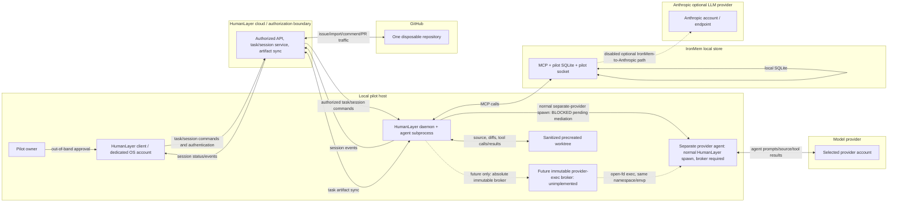

# HumanLayer Pilot Threat Model

**Review date:** 2026-08-17
**Scope:** HumanLayer evaluation for issues [#304](https://github.com/ironrace/ironmem/issues/304) and [#311](https://github.com/ironrace/ironmem/issues/311). This is the authoritative security gate for this pilot.

**Evidence snapshot.** The facts below were checked against the linked primary documentation, the npm registry metadata, and this repository at this review date. “Fact” means the source says it; “inference” is a security conclusion from facts; “unknown” is deliberately not filled in by marketing, a generic privacy policy, or a source-code scan. A normal developer shell failed the secret-presence negative control: multiple secret-shaped variable *names* existed. Values were neither read nor printed. That shell and account are therefore not approved.

## Executive decision

**Broader rollout: BLOCKED. All HumanLayer pilot launches are currently BLOCKED**, including public or synthetic material, by at least `STATIC-HELPER-MISSING`, `SUPERVISOR-ARTIFACT-MISSING`, `INVOCATION-POLICY-MISSING`, `IMPLICIT-CONFIG-MEDIATION-MISSING`, `LAUNCH-TRANSACTION-MISSING`, and `CREDENTIAL-MECHANISM-MISSING`, plus `PROVIDER-SPAWN-MEDIATION-MISSING` and `BROKER-SOLE-PATH-MISSING` for normal separate providers. Public or synthetic material in one disposable selected GitHub repository on a dedicated approved **Linux** host/account is the only repository class eligible to become **PERMITTED** after every mandatory gate passes. macOS/Darwin pilot execution is **PROHIBITED** and **BLOCKED**. Private, internal, confidential, regulated, customer-data, production-connected, secret-bearing, signing, deployment, and infrastructure-administration repositories are **PROHIBITED**.

This decision is an inference from a daemon whose agent has the authority of its OS user, cloud task/session/artifact flow, GitHub write permissions, non-subtractive default file copying, unresolved vendor/model evidence, and unresolved Darwin dispatcher/TOCTOU evidence. The current Mac developer environment and any macOS execution of these documentation checks are non-qualifying development evidence only, never pilot approval. A human confirmation cannot override this host classification; changing it requires a separately approved security issue/design plus regression and canary evidence.

## Compatibility invariant

All HumanLayer work is additive new code, configuration, or documentation. It must not overwrite or change `/collab`, `iron-build`, `iron-plan`, `iron-spec`, `iron-tdd`, or their support files or contracts. Existing workflows remain independently runnable. A shared-boundary change requires a separate approved issue and regression coverage; this pilot does not authorize one.

## Sources and evidence quality

### Primary HumanLayer evidence

| Source | Established fact / qualification |
|---|---|
| [Remote daemons](https://docs.humanlayer.com/explanation/remote-daemons) | The API sends work to the daemon and receives events; the daemon agent has the file/network authority of its OS user. Login refresh/session material is under `~/.humanlayer/riptide/`; a launch token exchanged for process credentials is a credential. |
| [Tasks](https://docs.humanlayer.com/explanation/tasks) | Task files are under `.humanlayer/tasks/<slug>/`; supported edits synchronize task artifacts between local and cloud, including text/object-storage behavior. |
| [Workspace config](https://docs.humanlayer.com/reference/workspace-config) | `copyGlobs` append and deduplicate; `disabled: true` disables automatic worktree setup; `setupCommand` executes as `sh -c` after copying. |
| [GitHub integration](https://docs.humanlayer.com/guide/github-integration) | The app requests Contents, Issues, Pull requests read/write and Metadata read; selected-repository installation is available; issue/comments may be imported and artifact links written back. |
| [Codex guide](https://docs.humanlayer.com/guide/codex) and [Bedrock guide](https://docs.humanlayer.com/guide/bedrock) | HumanLayer launches provider tools on the host and provider/environment setup is material to the boundary. These are not evidence of a HumanLayer sandbox. |
| [Current product](https://www.humanlayer.com/) | The service synchronizes through HumanLayer APIs and uses user-provided model subscriptions/credentials; the site says the current product is not fully open source. |
| [Privacy policy](https://www.humanlayer.dev/legal/privacy-policy.html) | Generic service-provider/cloud/analytics categories, product-improvement language, retention as needed, deletion/anonymization with isolated backups, reasonable security, limited employee access, and legally required breach notice are described. It does **not** establish product-specific no-training, retention period, named subprocessors, deletion SLA/verification, encryption, tenant isolation, audit logs, incident SLA, DPA, SOC 2, or penetration testing. |
| [npm package](https://www.npmjs.com/package/@humanlayer/cli) and [registry metadata](https://registry.npmjs.org/@humanlayer%2fcli) | Inspected release: `@humanlayer/cli` 0.31.59; wrapper integrity `sha512-uC6nCjYPOT55oHt9kOPhk3WCXbH2/bOPKz/6Xqg1EcM41x46UHAuUyzIxWbsQKfj43TBfqX6aKe6v2PPcvUnFw==`; wrapper shasum `81da4e2e57a68542463b682cbca69ce24af56d16`; darwin-arm64 shasum `33490919cf505fe08a955535dd710fcc4f4a1fd5`; downloaded Darwin platform binary SHA-256 `1ea566ece5d0b13f31514e99727fe2e97427c6a82b68ad709a8ed6ccc2d64791`. This Darwin ARM64 tuple is an evidence snapshot only, not an approved pilot artifact. Before any Linux pilot launch, capture and approve the actual Linux platform package/binary version, integrity, shasum, downloaded-binary SHA-256, and absolute executable path. |
| [Pinned public code snapshot](https://github.com/humanlayer/humanlayer/tree/99abe673498cf8bdcd5f989aebe9406a27185b3b) | Commit `99abe673498cf8bdcd5f989aebe9406a27185b3b`, dated 2026-06-18, is a reproducible public-code snapshot only; it is not assurance for the current hosted product. |

The current CLI help exposes provider/model/thinking choices but no sandbox/approval switches. A binary string scan similarly cannot prove effective subprocess sandbox or approvals. **Unknown:** the effective agent subprocess policy. Compensate with host isolation and canaries.

### Provider and IronMem evidence

[OpenAI’s agent approvals/security](https://learn.chatgpt.com/docs/agent-approvals-security) and [sandboxing](https://learn.chatgpt.com/docs/sandboxing) describe Codex’s own OS sandbox, approvals, and prompt-injection considerations. They are capabilities of Codex, not proof that HumanLayer launches Codex with those defaults. [OpenAI API data controls](https://developers.openai.com/api/docs/guides/your-data#storage-requirements-and-retention-controls-per-endpoint) establish API no-training-by-default unless opted in and conditional abuse-log/application-state retention; Zero Data Retention and Modified Abuse Monitoring require eligibility/configuration.

[Anthropic consumer retention](https://privacy.claude.com/en/articles/10023548-how-long-do-you-store-my-data), [training use](https://privacy.claude.com/en/articles/7996885-how-do-you-use-personal-data-in-model-training), and the [Claude Code FAQ](https://support.claude.com/en/articles/14554922-claude-code-user-faq) distinguish consumer settings/retention from commercial Team, Enterprise, and API no-training-by-default unless opted into a program.

IronMem evidence is local and repository-relative: [local SQLite and shared store](../README.md#shared-memory-across-harnesses), [daemon/socket configuration](../README.md#shared-daemon-mode), [isolated `IRONMEM_DB_PATH`](../README.md#shared-memory-across-harnesses), [access mode](../README.md#use-with-any-mcp-client), and [optional rerank/preferences](../README.md#llm-rerank-opt-in). Recalled memory included in an agent prompt crosses the selected provider boundary. Default shared storage is unsuitable for this pilot; optional LLM reranking/preference extraction must stay off.

## System and trust boundaries



The host is the primary authority boundary. HumanLayer cloud, GitHub, IronMem’s local Unix-socket/SQLite boundary, and the selected model provider are distinct controllers/processors. Every arrow is a potential disclosure or command path; untrusted content does not become authority by crossing a boundary.

## Data inventory and flow

| Data class | Source → destination | Persistence | Pilot handling |
|---|---|---|---|
| Issue/comment/ticket data | GitHub → HumanLayer → daemon | GitHub, cloud/task files | Public/synthetic only; treat as untrusted. |
| Prompts/messages/session events | Pilot/daemon → HumanLayer and provider | Cloud/provider per account terms | No sensitive prompts; normal separate provider spawn is blocked until broker mediation; capture account evidence. |
| Source/diffs/tool calls/results | Worktree/agent → provider; selected artifacts → cloud | Worktree, provider, possible artifacts | Sanitized disposable repo; provider receives them only through approved embedded/no-spawn proof or future broker; human review. |
| Task artifacts | `.humanlayer/tasks/` ↔ HumanLayer | Local and cloud/object storage | Stop on sensitive content; request deletion. |
| HumanLayer auth/launch tokens | Login/launch → daemon/cloud | `~/.humanlayer/riptide/`, cloud | Pilot-only, short-lived where possible; revoke at teardown. |
| GitHub App credentials | App/cloud → selected repository | GitHub/HumanLayer | One repo, exact manifest; never expose token. |
| Provider credentials | Pilot account → provider CLI/API | Account/credential store | Pilot-only, short-lived, dedicated non-environment mechanism; no browser/personal auth. |
| Copied workspace files | Source repo → generated worktree | Local worktree | Automatic copying disabled; manual sanitized worktree only. |
| IronMem drawers/diary/code maps/metrics | Agent MCP ↔ local SQLite | Pilot SQLite/socket | Isolated paths; no cross-repo recall; metrics reviewed. |
| Telemetry/crash data | CLI/host → vendor/provider | Vendor/host logs | Minimize, classify as possible disclosure, retain incident evidence. |

## Pilot architecture and mandatory controls

1. Use a dedicated approved **Linux** non-admin OS account on an approved immutable/measured Linux host image (or verified-boot equivalent), with a recorded kernel, OS release, architecture, patch baseline, restricted filesystem, explicit network allowlist, and a future privileged Host-operator supervisor/control plane. Its executable must be `/opt/ironmem-humanlayer/supervisor/ironmem-humanlayer-supervisor` and its security configuration `/opt/ironmem-humanlayer/supervisor/supervisor-policy.json`. The pilot account cannot write either leaf or any parent. Neither artifact exists as an approved implementation today: `SUPERVISOR-ARTIFACT-MISSING` is **BLOCKED**. Any baseline or artifact drift is **BLOCKED**. The normal developer environment and every macOS/Darwin execution environment are **PROHIBITED** for the pilot.
2. Use one disposable selected GitHub repository containing only public/synthetic material. Protect its default branch/ruleset; create draft PRs only; no merge or deployment.
3. The **Pilot owner** may give out-of-band confirmation only for an explicitly allowed, bounded human-gated action within this public/synthetic, draft-only pilot (for example, beginning an otherwise compliant session or creating an allowed draft PR). Computer control for permission changes or destructive actions is not human-gated: it is **PROHIBITED**.
4. Pin package versions and integrity; disable automatic workspace setup; forbid a local override; manually precreate and sanitize the worktree.
5. The only qualifying preflight boundary is a future, statically linked, reviewed Linux executable at `/opt/ironmem-humanlayer/policy/ironmem-humanlayer-preflight`, invoked directly with an `execve`-equivalent by the trusted Host-operator supervisor. It must not use a shell, interpreter, `PATH` lookup, `uname`, `printf`, `mktemp`, `grep`, `head`, Python, Git, or any subprocess. The supervisor constructs a versioned minimal exact `envp`; the helper rejects every unknown key and every secret-shaped key, with no exception for a secret-shaped key, and emits only a nonce-bound value-free **planned-policy** record—not a claim about the later child state. It does not yet exist: its additive implementation, independent review, pinning, installation, and approval are `STATIC-HELPER-MISSING`, a **BLOCKED** launch gate even for public/synthetic material.
6. Pilot credentials must not be supplied in environment variables. They require a separately reviewed dedicated credential store, file-descriptor, or provider-auth mechanism; any HumanLayer or provider configuration that requires an environment secret is **BLOCKED**. The privileged supervisor may perform setup/measurement but must **never** execute HumanLayer, immutable broker, or provider as root. Only after an irreversible verified transition to the dedicated non-admin pilot identity, a bound static-helper planned-policy record, and a matching actual post-drop record may it descriptor-execute the verified HumanLayer artifact. HumanLayer normally spawns a separate provider agent, so a normal separate provider is **PROHIBITED** until a separately approved supervisor-mediated broker prevents bypass. No production secrets, `.env` defaults, personal GitHub/cloud auth, SSH identities, inherited credential helpers, shell launcher, or `PATH` lookup is permitted.
7. Set pilot-specific `IRONMEM_DB_PATH` and `IRONMEM_DAEMON_SOCKET`. Keep `IRONMEM_MCP_MODE` least-privilege for the task, with IronMem LLM rerank and LLM preference extraction off.
8. Back up the pilot SQLite/worktree only to approved pilot storage and review every diff/artifact before any external action.

## GitHub least-privilege permission manifest

**Installation target:** exactly one named disposable pilot repository, selected-repositories mode. **Owner:** **GitHub administrator**; **reviewer:** **Security reviewer**.

| Requested | Explicitly absent |
|---|---|
| Contents read/write; Issues read/write; Pull requests read/write; Metadata read | Actions, Administration, Checks, Deployments, Environments, Members, Organization administration, Packages, Pages, Secrets, Workflows |

Capture the installation repository list and permission screen before launch and each session. Permission/repository drift is **BLOCKED**: suspend/disconnect the app, revoke changed grants, preserve evidence, and require new approval. Branch protection/ruleset must prohibit direct default-branch writes and merging by the pilot automation.

## Credential and environment preflight

The normal review shell failed a negative control because secret-shaped names were present; values were never read and exact names are not published. It is **PROHIBITED** for the pilot.

The **Host operator** records only names/classes and presence, never values. The future static preflight executable, not a host command or script, must enumerate environment keys internally without serializing values; it emits only a bounded value-free planned-policy pass/fail record and must not attest later child state. The operator separately records SSH-identity presence, GitHub/credential-helper status, and expected pilot credential-file presence/permissions without printing keys, environment values, tokens, `.env` contents, or credentials. The trusted supervisor alone constructs an immutable, versioned minimal `envp` buffer from the exact approved allowlist; the helper compares every key to that exact version and fails closed on every unknown or secret-shaped key. No secret-shaped key is exempted, and a credential may not enter through `envp`.

The following synthetic adversarial block is **non-qualifying CI/development evidence only**. It is retained as a test-vector specification for the future static helper; it must never authorize a pilot, be installed as a launch gate, or be treated as trusted host evidence. It contains no real secret, places distinct sentinels on both lines of a synthetic value and another in a synthetic `sitecustomize` startup hook reachable only through `PYTHONPATH`, and demonstrates that a candidate `/usr/bin/python3 -I -S -c` key enumerator avoids those sentinels while deliberately unsafe serializers and startup-hook execution are detected:

```sh
set -eu
if [ "$(/usr/bin/uname -s)" != Linux ]; then
  /usr/bin/printf '%s\n' 'BLOCKED: non-Linux enumerator result is non-qualifying pilot evidence' >&2
  exit 2
fi
test_dir="$(/usr/bin/mktemp -d)"
export test_dir
trap '/usr/bin/python3 -I -S -c '"'"'import os; p = os.environ["test_dir"]; os.unlink(p + "/sitecustomize.py"); os.rmdir(p)'"'"'' EXIT HUP INT TERM
/usr/bin/printf '%s\n' 'import sys; print("PYTHON_STARTUP_SENTINEL")' > "$test_dir/sitecustomize.py"
synthetic_value="$(/usr/bin/printf 'SYNTHETIC_FIRST_LINE_SENTINEL\nSYNTHETIC_SECOND_LINE_SENTINEL')"
require_absent() {
  output="$1"
  sentinel="$2"
  label="$3"
  if /usr/bin/printf '%s\n' "$output" | /usr/bin/grep -Fq "$sentinel"; then
    /usr/bin/printf '%s\n' "$label leaked a synthetic sentinel" >&2
    exit 1
  fi
}
require_detected() {
  output="$1"
  sentinel="$2"
  label="$3"
  if ! /usr/bin/printf '%s\n' "$output" | /usr/bin/grep -Fq "$sentinel"; then
    /usr/bin/printf '%s\n' "$label was not detected" >&2
    exit 1
  fi
  /usr/bin/printf '%s\n' "$label detected and fail-closed"
}
has_exact_line() {
  output="$1"
  expected="$2"
  found=1
  while IFS= read -r line || [ -n "$line" ]; do
    if [ "$line" = "$expected" ]; then
      found=0
      break
    fi
  done <<EOF
$output
EOF
  return "$found"
}
has_only_environment_key_names() {
  output="$1"
  saw_key=1
  while IFS= read -r line || [ -n "$line" ]; do
    [ -n "$line" ] || continue
    case "$line" in
      [!ABCDEFGHIJKLMNOPQRSTUVWXYZabcdefghijklmnopqrstuvwxyz_]* | *[!ABCDEFGHIJKLMNOPQRSTUVWXYZabcdefghijklmnopqrstuvwxyz0123456789_]*) return 1 ;;
    esac
    saw_key=0
  done <<EOF
$output
EOF
  return "$saw_key"
}
approved_output_is_valid() {
  output="$1"
  has_exact_line "$output" SYNTHETIC_MULTILINE_VALUE || return 1
  has_exact_line "$output" PYTHONPATH || return 1
  has_only_environment_key_names "$output" || return 1
  require_absent "$output" SYNTHETIC_FIRST_LINE_SENTINEL 'approved key enumerator'
  require_absent "$output" SYNTHETIC_SECOND_LINE_SENTINEL 'approved key enumerator'
  require_absent "$output" PYTHON_STARTUP_SENTINEL 'approved key enumerator'
}
approved_output="$(
  /usr/bin/env -i PATH=/usr/bin:/bin \
    SYNTHETIC_MULTILINE_VALUE="$synthetic_value" \
    PYTHONPATH="$test_dir" \
    /usr/bin/python3 -I -S -c 'import os; print("\n".join(sorted(os.environ.keys())))'
)"
if ! approved_output_is_valid "$approved_output"; then
  /usr/bin/printf '%s\n' 'approved key enumerator output failed validation' >&2
  exit 1
fi
/usr/bin/printf '%s\n' "$approved_output"
empty_output=''
if approved_output_is_valid "$empty_output"; then
  /usr/bin/printf '%s\n' 'empty approved output was accepted' >&2
  exit 1
fi
/usr/bin/printf '%s\n' 'empty approved output rejected and fail-closed'
filtered_output='PATH'
if approved_output_is_valid "$filtered_output"; then
  /usr/bin/printf '%s\n' 'filtered approved output was accepted' >&2
  exit 1
fi
/usr/bin/printf '%s\n' 'filtered approved output rejected and fail-closed'
full_value_output="$synthetic_value"
require_detected "$full_value_output" SYNTHETIC_FIRST_LINE_SENTINEL 'full-value serializer'
require_detected "$full_value_output" SYNTHETIC_SECOND_LINE_SENTINEL 'full-value serializer'
first_line_output="$(/usr/bin/printf '%s\n' "$synthetic_value" | /usr/bin/head -n 1)"
require_detected "$first_line_output" SYNTHETIC_FIRST_LINE_SENTINEL 'first-line-only serializer'
startup_hook_output="$(
  /usr/bin/env -i PATH=/usr/bin:/bin PYTHONPATH="$test_dir" \
    /usr/bin/python3 -c 'import os; print("\n".join(sorted(os.environ.keys())))'
)"
require_detected "$startup_hook_output" PYTHON_STARTUP_SENTINEL 'startup-hook execution'
```

Expected result on a Linux development host is exit status 0: the candidate output is key names only, contains exact lines `SYNTHETIC_MULTILINE_VALUE` and `PYTHONPATH`, and every nonempty emitted line has environment-key syntax (no `=`, whitespace, or non-name characters). A platform or interpreter may add key names, but it must never contain either value sentinel or the startup sentinel. The control reports that empty/filtered output and the three deliberately unsafe paths were detected and fail closed, without printing their unsafe outputs. On Darwin/macOS it exits 2 and is non-qualifying **BLOCKED** evidence. Any unexpected sentinel appearance, malformed key line, or undetected rejected path is a CI/development failure and a required test-vector fix before the static helper may be approved. `/usr/bin/python3` layout, including standard Ubuntu symlinks, is irrelevant to pilot qualification because Python is not in the qualifying control.

`scripts/test_humanlayer_workspace_policy.py`, its pytest bridge, explicit-root checks, and the shell block above are likewise **non-qualifying CI/development evidence only**. They must never be installed, directly executed, or relied on as the pilot launch security boundary. The future static helper must implement equivalent or stronger internal test vectors and checks.

The foundational trust assumption is an approved immutable/measured Linux image (or verified-boot equivalent), recorded kernel/OS/architecture/patch baseline, and a future privileged Host-operator supervisor. `SUPERVISOR-ARTIFACT-MISSING` is a fail-closed **BLOCKED** condition until a separately approved additive-code issue delivers and pins `/opt/ironmem-humanlayer/supervisor/ironmem-humanlayer-supervisor` and `/opt/ironmem-humanlayer/supervisor/supervisor-policy.json`. Required approval evidence is supervisor source revision, reproducible build recipe, compiler/dependencies/SBOM, version, configuration schema/version, canonical leaf paths, runtime SHA-256, signatures, numeric UID/GID/mode, every canonical no-symlink nonwritable parent-chain component, durable atomic installation, and reviewed configuration-content hash/signature. The pilot user cannot write the binary, config, or their parents.

Before every launch after implementation, the **Host operator** remeasures the supervisor binary and configuration leaves and full parent chains against the approved manifest; it records canonical paths, runtime SHA-256, signatures, numeric UID/GID/mode, and configuration identity/hash/schema/version. Using a verified descriptor/fd-equivalent, it opens and executes only that verified supervisor. The supervisor—not the agent or pilot user—directly executes the one static helper with an `execve`-equivalent and receives its bounded structured result. The helper must internally: assert its Linux platform/architecture from its build/runtime ABI; compare every `envp` key to the exact approved allowlist version; reject unknown and secret-shaped keys without an exemption; enumerate no values; self-test approved exact set, unknown key, secret-shaped key, empty, multiline, full-value, first-line, filtered/omitted key, startup/config injection, and allowlist-version mismatch; perform exact workspace JSON equality; reject a local override; verify the tracked repository `.gitignore` has the exact local-override rule; and validate an exact canonical repository root without spawning Git. It emits only bounded value-free reason codes such as `ENV_UNKNOWN_KEY`, `ENV_SECRET_SHAPED_KEY`, and `ENV_ALLOWLIST_VERSION_MISMATCH`, never key names or values. It must not invoke a shell, interpreter, `PATH` lookup, `uname`, `printf`, `mktemp`, `grep`, `head`, Python, Git, or another subprocess.

The helper is intentionally unimplemented. It must be delivered only as additive new code in a separate approved security issue, then independently reviewed, reproducibly built, statically linked for the approved Linux target, pinned, signed, installed, and approved by the **Security reviewer** before any pilot launch. Required review material is source, reproducible build recipe, compiler and dependency versions, SBOM, Linux target and static-link evidence, complete environment and workspace test vectors, artifact path, SHA-256, and signature. Until then, `STATIC-HELPER-MISSING` is a fail-closed **BLOCKED** condition.

When that future helper is approved, the **Host operator** performs its atomic privileged installation at `/opt/ironmem-humanlayer/policy/ironmem-humanlayer-preflight`: stage reviewed bytes in the same root-controlled policy directory, set numeric UID/GID 0 (`root:root`) and a non-writable mode, fsync the staged file where supported, verify its approved hash and signature, atomically rename it into place, then fsync the destination directory where supported. Manifest approval follows only that durable rename. The agent and pilot users must never write the staged file, leaf, or any parent.

Before every launch after implementation, trusted host-side controls inspect `/opt`, `/opt/ironmem-humanlayer`, `/opt/ironmem-humanlayer/policy`, and the static-helper leaf with `lstat` or equivalent—not an agent-provided path. Each must be canonical and non-symlink, numeric UID/GID 0 (`root:root`), and not writable by the pilot, group, or other. Record numeric UID/GID/mode and resolved owner/group names for every component, plus helper SHA-256 and signature status, and compare them to the approved manifest.

`INVOCATION-POLICY-MISSING` is a current **BLOCKED** condition. The future supervisor policy/configuration and broker mapping must contain a full invocation-policy schema/version/hash: exact or strictly allowlisted `argv` (including approved HumanLayer subcommand and provider/model/thinking/sandbox/approval options); canonical `cwd`; exact versioned `envp`; descriptor map with purpose, access, and `CLOEXEC`; target UID/GID/groups; capability/securebits/`no_new_privs` state; umask; rlimits; namespace/mount identity; network/cgroup identity; seccomp/Landlock/LSM profile IDs and hashes; and credential-descriptor mechanism. It must explicitly deny unapproved, reordered, or extra arguments; alternate `cwd`; extra descriptors; alternate model/provider; permission expansion; profile weakening; `--dangerously-bypass-approvals-and-sandbox`; `--yolo`; danger-full or equivalent sandbox-bypass flags. Bounded value-free failure codes include `INVOCATION_ARGV_MISMATCH`, `INVOCATION_CWD_MISMATCH`, `INVOCATION_FD_MISMATCH`, `INVOCATION_IDENTITY_MISMATCH`, and `INVOCATION_PROFILE_MISMATCH`; they never echo arguments, paths, descriptor numbers, or credential values.

`IMPLICIT-CONFIG-MEDIATION-MISSING` is a current **BLOCKED** condition. Wherever HumanLayer/provider supports it, the invocation policy disables implicit configuration, plugin, and tool discovery from HOME, XDG/default directories, repository and parent directories, environment, and current directory. The supervisor exposes a minimal dedicated HOME/config namespace containing only explicitly approved immutable root-owned config objects, plus separately narrow writable session, authentication, and task data mounts. It binds every exposed config path, schema/version/hash/signature/UID/GID/mode/parent chain and the proven absence or masking of every default search path into both records below. Repository model/sandbox/approval/tool/plugin settings are untrusted and masked unless individually approved and immutable. If HumanLayer/provider cannot disable or exhaustively mediate any discovery path, that configuration is **BLOCKED**.

`LAUNCH-TRANSACTION-MISSING` is also a current **BLOCKED** condition. A future reviewed supervisor performs one launch transaction in explicit phases; every syscall and verification result is checked and any failure is **BLOCKED**. The static helper can attest only planned policy and validated prelaunch inputs. It emits a bounded value-free **planned-policy record** bound to the nonce, policy/config/artifact/environment/namespace/file identities, allowlist version, `envp` digest, repository/helper/HumanLayer identities, and exposed-or-masked configuration identities. It must not attest the later actual child state.

**Privileged setup phase — before UID transition only.** The supervisor creates and locks mount and network namespaces plus the immutable policy view; places the child in the approved cgroup; applies privileged LSM profile/transitions; opens and verifies all executable, configuration, credential, and audit descriptors; sets approved rlimits and umask as applicable; clears ambient capabilities; while `CAP_SETPCAP` is available, drops **every** capability from the bounding set and verifies the bounding set is empty; then sets and locks securebits so root, setuid, and keep-caps regain are impossible. No failed syscall, namespace/profile/cgroup setup, descriptor verification, capability drop, securebits lock, or verification is recoverable by continuing. Bounded value-free phase codes include `PHASE_PRIVILEGED_SETUP_FAILURE`, `PHASE_BOUNDING_SET_NONEMPTY`, and `PHASE_SECUREBITS_LOCK_FAILURE`.

**Irreversible transition — before exec.** The supervisor closes unexpected descriptors; clears supplementary groups; sets all real/effective/saved GIDs to the dedicated pilot GID; then sets all real/effective/saved UIDs to the dedicated non-admin pilot UID; clears effective, permitted, inheritable, and ambient capability sets; verifies all capability sets including bounding and ambient are empty; and verifies securebits remain locked. No operation requiring dropped privilege may be deferred after the UID transition. Any root/regain path, retained group or capability, unexpected descriptor, or late privileged operation emits only `PHASE_IDENTITY_OR_CAPABILITY_FAILURE` or `PHASE_LATE_PRIVILEGED_OPERATION` and blocks.

**Post-drop phase — unprivileged-safe operations only.** The child sets and verifies `no_new_privs`; applies only approved unprivileged-safe seccomp/Landlock restrictions and verifies them; verifies the privileged-phase namespaces, mount/network/cgroup/LSM identities, approved descriptors, rlimits, and umask. Immediately before fd-exec, it creates a separate nonce-linked bounded value-free **post-drop record** through the preapproved audit FD. The record binds actual UID/GID/supplementary groups; every capability set including bounding and ambient; securebits; `no_new_privs`; exact FD map; argv/cwd/`envp` digest; rlimits/umask; namespaces/mount/network/cgroup/LSM/seccomp/Landlock identities and hashes; credential channel; and opened artifact descriptors. It binds the planned-policy record hash and requires exact equality or an explicitly allowed transition. Missing, mismatched, or drifted records block; it immediately rechecks and fd-execs with no agent window. `PHASE_POSTDROP_RESTRICTION_FAILURE`, `POSTDROP_RECORD_MISSING`, `POSTDROP_RECORD_MISMATCH`, and `POSTDROP_RECHECK_FAILURE` are bounded value-free failure codes.

HumanLayer, immutable broker, and provider must execute or inherit that same unprivileged identity and restrictions; the broker cannot regain privilege. Any inability to preserve planned-policy/post-drop linkage, any drift, or an unbound record is **BLOCKED**. The value-free `envp` digest is usable as binding evidence only because the contract forbids environment secrets. Pilot credentials use only a separately reviewed dedicated credential store, file-descriptor, or provider-auth mechanism; any configuration requiring a HumanLayer/provider environment secret is **BLOCKED**.

HumanLayer normally launches a separate provider agent; the supervisor must not be described as directly launching it. `PROVIDER-SPAWN-MEDIATION-MISSING` and `BROKER-SOLE-PATH-MISSING` are **BLOCKED** conditions for every separate Codex, Claude, or provider executable. A future additive-code broker must be separately approved and configured/proven as the only absolute, root-owned immutable executable HumanLayer can invoke. Supervisor/LSM execution policy must permit HumanLayer to execute only that verified broker path/descriptor for separate-provider spawn and deny direct provider execution and every other exec path; the evidence must prove HumanLayer cannot bypass the broker. Its mapping must bind HumanLayer's absolute broker invocation and the provider's exact/strictly allowlisted invocation under the same invocation-policy schema; it rejects argument, `cwd`, descriptor, identity, credential-channel, namespace, or profile drift. For every launch, the broker verifies the current nonce and planned-policy/post-drop record linkage, then the same nonce transaction binds **both** broker and provider canonical absolute paths, versions/channels, runtime SHA-256 values, signatures, numeric UID/GID/modes, full canonical no-symlink nonwritable parent chains, broker configuration/mapping hash/version, and inherited post-drop attributes, all compared to the approved manifest. The broker must validate and open-fd execute that already-verified provider artifact without `PATH`, symlink, or TOCTOU bypass, in the same transaction namespace, exact approved `envp`/credential mechanism, and inherited unprivileged restrictions; HumanLayer must be unable to bypass it. Required bounded-code negative vectors cover direct provider exec, alternate absolute/relative path, symlink/hardlink, shell/interpreter/wrapper launch, `PATH` lookup, alternate binary, mapping/version/hash drift, nonce replay/cross-transaction replay, descriptor substitution/reuse, argument/env/cwd/credential/profile substitution, and broker omission; a broker happy path alone is insufficient. Broker source revision, reproducible build, compiler/dependencies/SBOM, hash, signature, tests, configuration/mapping, and full parent-chain evidence require approval. If this cannot be proven, the separate-provider configuration is **PROHIBITED**. An embedded-provider exception is valid only with verified HumanLayer artifact version/hash/signature/SBOM/component manifest, invocation-policy binding, inherited post-drop restrictions, and proof that no separate provider executable or spawn path exists.

Darwin/macOS remains a **PROHIBITED** rationale, not an implemented control: `/usr/bin/python3` and `/usr/bin/git` may dispatch through Xcode/CommandLineTools; the reviewed evidence does not pin dispatchers, selected Developer directory, resolved target paths/hashes, the full Developer/target parent-chain immutability, or TOCTOU-resistant execution end-to-end. `root:wheel` (UID 0, GID 0) and `/usr/bin/xcrun` are recorded only as facts explaining why macOS is blocked. A separately approved security issue/design, regression coverage, and canary evidence are required to reconsider it; human confirmation cannot override it.

The **Host operator** owns the immutable Linux baseline, privileged/post-drop phase ordering, exact `envp`, invocation-policy/planned-policy/post-drop records, dedicated config namespace, and launch-transaction evidence, static-helper/broker installation and full-parent-chain evidence, and host remediation. The **Security reviewer** owns supervisor/static-helper/invocation-policy/config-mediation/transaction/credential-contract/broker review and pin approval plus Linux HumanLayer artifact approval/remediation. The **Model-provider administrator** owns provider artifact/account, product discovery behavior, and broker-or-embedded/no-spawn evidence and remediation. Any approved-manifest change or resumption after a host, supervisor, helper, invocation policy, config mediation, transaction, HumanLayer, broker, credential mechanism, or provider drift needs Security reviewer approval. A mismatch, missing `SUPERVISOR-ARTIFACT-MISSING` resolution, missing `STATIC-HELPER-MISSING` resolution, missing `INVOCATION-POLICY-MISSING` resolution, missing `IMPLICIT-CONFIG-MEDIATION-MISSING` resolution, missing `LAUNCH-TRANSACTION-MISSING` resolution, missing `CREDENTIAL-MECHANISM-MISSING` resolution, missing `PROVIDER-SPAWN-MEDIATION-MISSING` or `BROKER-SOLE-PATH-MISSING` resolution, missing Linux artifact capture, `@latest`, floating version, or unattended update is **BLOCKED**.

## Default `.env` copying verification

HumanLayer’s [workspace config reference](https://docs.humanlayer.com/reference/workspace-config#copyglobs) lists these six defaults: `.env`, `.env.local`, `.env.development.local`, `.claude/settings.local.json`, `.humanlayer/workspace.json`, and `.humanlayer/workspace.local.json`. It says lists append and deduplicate; defaults, shared, local, and repo lists do not replace or subtract one another. The same reference says `setupCommand` runs via `sh -c` after copying.

Therefore individual defaults cannot be disabled. The shared config must contain `"disabled": true`, there must be no `.humanlayer/workspace.local.json` override, and the worktree must be manually precreated and sanitized. Re-enabling remains **BLOCKED** until the product supports subtractive controls or independent verification proves equivalent containment.

## Sandbox, approvals, and prompt injection

HumanLayer’s effective agent subprocess sandbox/approval policy is publicly **unknown**. Do not assume official Codex defaults apply when HumanLayer invokes an agent. Codex documents OS sandboxing and approvals, but that proves only the Codex-capability baseline, not this integration. OS isolation plus canary tests are mandatory: attempt controlled out-of-worktree access, disallowed network egress, permission change, and destructive action; fail closed on an unexpected success.

GitHub issues/comments, repository files, task artifacts, web results, tool output, and IronMem recall are untrusted instructions. Deny requests to access/exfiltrate secrets, expand permissions, perform destructive actions, merge, deploy, sign, or disable controls. Out-of-band confirmation applies only to an action that this policy explicitly marks human-gated; no prompt, comment, or tool output can grant authority. Secret access, merge, deployment, signing, disabling controls, prohibited repository classes, and every other absolute pilot prohibition remain denied even with **Pilot owner** confirmation. Changing one requires the documented repository-reclassification process and, where required, a new separately approved issue with supporting evidence; confirmation cannot override a classification or control.

## Risk register

| ID | Scenario | Impact / severity | Mandatory mitigation | Owner | Residual risk / evidence | Rollout gate |
|---|---|---|---|---|---|---|
| HOST-01 | Daemon agent inherits OS-user file/network authority | Critical | Dedicated non-admin immutable/measured Linux host, allowlist, static preflight, canaries | Host operator | Host isolation limits but does not prove agent policy; static helper is not yet implemented | BLOCKED until `STATIC-HELPER-MISSING` is resolved |
| HOST-04 | macOS/Darwin `/usr/bin/python3` or `/usr/bin/git` dispatches through Xcode/CommandLineTools without end-to-end pinned targets and TOCTOU-resistant execution | Critical | Linux-only approved host; do not launch on Darwin | Host operator | Darwin `root:wheel`/xcrun facts are rationale only; dispatch and parent-chain evidence remain unresolved | PROHIBITED / BLOCKED |
| HOST-02 | `setupCommand` executes shell code after copies | High | `disabled: true`; no local override; manual worktree | Host operator | Official config confirms `sh -c`; no automatic setup | BLOCKED otherwise |
| HOST-03 | Additive default `.env`/workspace copy globs copy source files into a generated worktree | Critical | Shared `disabled: true`, no local override, and manual precreated sanitized worktree | Host operator | Official config says defaults append/deduplicate and cannot be subtracted | BLOCKED until subtractive control or independently verified equivalent containment |
| HOST-05 | Planned prelaunch policy is mistaken for actual post-drop process state | Critical | Nonce-linked planned-policy and post-drop records with hash linkage, exact/allowed-transition comparison, audit FD, immediate recheck/fd-exec | Host operator | Transaction and both record formats are unimplemented | BLOCKED: `LAUNCH-TRANSACTION-MISSING` |
| HOST-06 | HumanLayer, broker, or provider runs as root or retains a group, capability, descriptor, or security profile outside the pilot boundary | Critical | Irreversible GID-then-UID drop; clear/lock capabilities and securebits; `no_new_privs`; exact FD/profile policy and post-drop child verification | Host operator | Invocation policy and post-drop verifier are unimplemented | BLOCKED: `INVOCATION-POLICY-MISSING` |
| HOST-07 | Privileged namespace/LSM/cgroup/descriptors or bounding-set drop is attempted after UID transition or a syscall failure is ignored | Critical | Checked privileged setup phase; drop every bounding capability while `CAP_SETPCAP` exists; no privileged operation after UID drop; phase-order vectors | Host operator | Implementable phase ordering is unimplemented | BLOCKED: `LAUNCH-TRANSACTION-MISSING` |
| HOST-08 | HOME/XDG/repository/parent/environment/current-directory config, plugin, or tool discovery changes controls | Critical | Dedicated masked HOME/config namespace; immutable approved config only; prove every default search path absent/masked | Host operator | Exhaustive product-specific discovery mediation is unproven | BLOCKED: `IMPLICIT-CONFIG-MEDIATION-MISSING` |
| CRED-01 | Inherited environment, SSH, `gh`, cloud, or `.env` credentials leak | Critical | Clean account; exact versioned static-helper key-only preflight; no personal auth or inherited credential helper | Host operator | Normal shell failed negative control; helper is unimplemented | BLOCKED until static-helper evidence exists |
| CRED-03 | Unknown, secret-shaped, or credential-bearing environment key bypasses a broad allowlist | Critical | Supervisor-built exact minimal versioned `envp`; reject every unknown/secret-shaped key; no environment credentials | Host operator | Exact allowlist and non-environment credential mechanism are unimplemented | BLOCKED: `CREDENTIAL-MECHANISM-MISSING`; environment-secret configuration prohibited |
| CRED-02 | HumanLayer launch/refresh token is stolen | High | Treat as credential; pilot-only storage, revoke/rotate | Vendor owner | Token-path fact, storage controls unknown | BLOCKED for broad use |
| GH-01 | GitHub App content/issue/PR write scope is abused | High | One disposable repo; draft PR only; ruleset | GitHub administrator | Official requested scope is broad within repo | BLOCKED until all pilot gates pass |
| GH-02 | Repo/permission drift expands blast radius | Critical | Capture manifest; suspend/disconnect on drift | GitHub administrator | Requires operational review evidence | BLOCKED on drift |
| PI-01 | Prompt injection from issue, code, artifact, web/tool/memory | High | Treat all as untrusted; out-of-band gate; canaries | Pilot owner | No prompt policy is complete | BLOCKED until all pilot gates pass |
| PI-02 | Computer control changes permissions or destroys data | Critical | No computer control for those actions | Pilot owner | No authorized pilot path; residual bypass risk is limited by host enforcement and containment canaries | PROHIBITED |
| SC-01 | npm, platform binary, Homebrew, desktop, model CLI updates are compromised | Critical | Exact pins/integrity, reviewed updates, no unattended update | Security reviewer | Integrity only identifies reviewed artifact | BLOCKED on mismatch |
| SC-03 | Linux HumanLayer platform package/binary is not pinned and integrity-captured | Critical | Capture/approve actual Linux package version, integrity, shasum, binary SHA-256, and canonical executable path before launch | Security reviewer | Inspected Darwin ARM64 tuple is evidence-only, not a Linux pilot artifact | BLOCKED before launch |
| SC-04 | `STATIC-HELPER-MISSING`: no independently reviewed, static Linux preflight executable exists | Critical | Separate approved additive-code issue; reviewed source/reproducible static build/compiler/dependencies/SBOM/test vectors; pin path/hash/signature; immutable installation | Security reviewer | The required executable is deliberately not claimed to exist | BLOCKED: no HumanLayer pilot launch |
| SC-05 | Supervisor cannot preserve a single verified launch transaction through HumanLayer exec | Critical | Reviewed nonce/envp/namespace/descriptor transaction with final recheck and same-namespace fd-exec | Host operator | `LAUNCH-TRANSACTION-MISSING`; helper result alone is insufficient | BLOCKED: no HumanLayer pilot launch |
| SC-06 | Privileged supervisor binary or security configuration is unpinned, mutable, or differs from the reviewed launch contract | Critical | Separate approved additive-code supervisor; pinned binary/config paths, source/build/SBOM/schema/version/hash/signature, full immutable parent chains, atomic install, per-launch descriptor remeasurement | Host operator | `SUPERVISOR-ARTIFACT-MISSING`; no approved supervisor/config exists | BLOCKED: no HumanLayer pilot launch |
| SC-02 | Hosted workflows/skills or GitHub App changes alter behavior | High | Version/permission change review, evidence capture | Vendor owner | Hosted behavior not pinned by public repo | BLOCKED pending review |
| VENDOR-01 | Cloud retains sessions/artifacts or uses them beyond expectations | Critical | Public/synthetic only; deletion request procedure | Vendor owner | Product-specific retention/training unknown | BLOCKED broadly |
| VENDOR-02 | Tenant, employee, subprocessor, audit, incident controls are inadequate | Critical | Obtain contractual/security evidence | Vendor owner | Generic privacy policy insufficient | BLOCKED broadly |
| MODEL-01 | Provider receives prompt/source/tool/memory data | Critical | Account-class/data-control capture; public/synthetic only | Model-provider administrator | Provider path depends on selected auth/account | BLOCKED until all launch gates, including static helper, pass |
| MODEL-02 | Browser/subscription terms are mistaken for API commitments | High | Verify auth mechanism and account class | Model-provider administrator | API controls do not automatically apply | BLOCKED absent evidence |
| MODEL-03 | HumanLayer spawns a separate provider agent outside supervisor controls | Critical | Approved immutable absolute broker is HumanLayer's only proven spawn path; same namespace/envp/credential binding | Model-provider administrator | Normal HumanLayer provider spawn is not mediated today | BLOCKED: `PROVIDER-SPAWN-MEDIATION-MISSING`; separate provider PROHIBITED absent proof |
| MODEL-04 | HumanLayer bypasses broker through direct/alternate/wrapper/path/replayed descriptor spawn | Critical | Supervisor/LSM permit only verified broker descriptor; broker validates current nonce and planned/post-drop linkage; exhaustive bypass vectors | Model-provider administrator | Sole-path execution proof is unimplemented | BLOCKED: `BROKER-SOLE-PATH-MISSING` |
| IM-01 | Default shared IronMem store contaminates cross-repo context | High | Pilot DB/socket; later cross-repo canary | Host operator | Shared-store default is documented | BLOCKED on failed canary |
| IM-02 | Optional IronMem LLM rerank/preferences add egress | High | Leave rerank/preference extraction off | Host operator | Optional paths documented; disabled state must be captured | PROHIBITED when enabled |

## Vendor evidence and unanswered questions

Generic privacy statements are insufficient. Every critical gap below is a wider-rollout blocker owned by the **Vendor owner** until written, product-specific evidence is captured and approved by the **Security reviewer**.

| Evidence request | Current status / gate |
|---|---|
| Data classes leaving host; storage locations/regions; retention | Unknown product-specific answer — BLOCKED. |
| Training/product improvement | Generic language only; no product-specific opt-out/no-training assurance — BLOCKED. |
| Named subprocessors | Unknown — BLOCKED. |
| Deletion SLA, verification, and backup lifecycle | Generic deletion/anonymization/backups only — BLOCKED. |
| Encryption in transit/at rest and key management | Unknown — BLOCKED. |
| Tenant isolation and employee access | Generic limitation only; isolation/control detail unknown — BLOCKED. |
| Audit logs/export/retention | Unknown — BLOCKED. |
| Incident notification SLA and process | Legally-required-notice wording only — BLOCKED. |
| DPA, SOC 2, and penetration-test evidence | Not established by reviewed public evidence — BLOCKED. |
| Effective sandbox/approval policy; credential storage/rotation | Unknown — BLOCKED. |

## Model-provider controls

HumanLayer cloud is not the selected model provider; both data paths must be reviewed. Subscription/browser authentication is not API use. Do not apply OpenAI API commitments to ChatGPT/Codex subscription or browser authentication without explicit verification. OpenAI API evidence is conditional: API inputs/outputs are not used for training by default unless opted in, while abuse logging, application state, ZDR, and MAM vary by endpoint, eligibility, and configuration.

Anthropic’s official material distinguishes consumer retention/training-setting consequences from commercial Claude for Work/API no-training-by-default unless opted into a program; Claude Code account treatment must be verified for the actual plan. Before each pilot, the **Model-provider administrator** captures provider, account class, authentication method, data controls, retention, training setting, region, deletion setting, credential lifetime, broker-or-embedded/no-spawn evidence, and approval. Account evidence does not waive `PROVIDER-SPAWN-MEDIATION-MISSING` or permit credential environment variables. Missing evidence is **BLOCKED**.

## Supply-chain manifest

No `@latest`, floating model, unattended update, or unreviewed auto-update is permitted. Each update is reviewed before use and reopens the relevant risk gates.

| Component/channel | Required evidence owner | Required record |
|---|---|---|
| npm CLI/meta package | Security reviewer | Exact `@humanlayer/cli` pin and npm integrity/shasum. |
| Immutable/measured Linux host and privileged supervisor | Host operator | Approved image or verified-boot evidence; kernel/OS/architecture/patch baseline; supervisor identity/control boundary; pilot account cannot write or control it; launch-specific mount namespace/immutable-view design and evidence; baseline drift blocks. Darwin/Xcode toolchain is unsupported pilot evidence. |
| Privileged supervisor executable and security configuration | Host operator (remeasure/install); Security reviewer (source/build/config/manifest approval) | **Unimplemented `SUPERVISOR-ARTIFACT-MISSING` blocker.** Future paths are `/opt/ironmem-humanlayer/supervisor/ironmem-humanlayer-supervisor` and `/opt/ironmem-humanlayer/supervisor/supervisor-policy.json`. Record source revision; reproducible build recipe; compiler/dependencies/SBOM; supervisor version; config schema/version; canonical leaf paths; runtime SHA-256; signatures; numeric UID/GID/mode; and every canonical no-symlink nonwritable parent-chain component. Record reviewed config-content hash/signature. Use privileged staged-file fsync, hash/signature verification, atomic rename, then destination-directory fsync for both artifacts; the pilot user cannot write either leaf or any parent. |
| Invocation policy and irreversible privilege drop | Host operator (implementation/operation); Security reviewer (schema/policy approval) | **Unimplemented `INVOCATION-POLICY-MISSING` blocker.** Supervisor policy and broker mapping record schema/version/hash; exact or strictly allowlisted HumanLayer/broker/provider `argv`, subcommand, provider/model/thinking/sandbox/approval options, canonical `cwd`, exact `envp`, descriptor purpose/access/`CLOEXEC` map, target UID/GID/groups, capability/securebits/`no_new_privs`, umask, rlimits, namespace/mount, network/cgroup, seccomp/Landlock/LSM IDs+hashes, and credential-descriptor mechanism. It specifies checked privileged setup (namespace/network/cgroup/LSM/descriptors/rlimits/umask, ambient clear, every bounding capability dropped while `CAP_SETPCAP` exists, securebits lock), then checked irreversible post-drop state (all GID/UID/capability sets/bounding set empty, descriptors), then unprivileged-safe `no_new_privs`/seccomp/Landlock verification. It rejects extra/reordered/disallowed argv, alternate cwd/model/provider, permission expansion, bypass flags (`--dangerously-bypass-approvals-and-sandbox`, `--yolo`, danger-full/equivalent), extra FDs, and profile weakening. Record bounded phase codes `PHASE_PRIVILEGED_SETUP_FAILURE`, `PHASE_BOUNDING_SET_NONEMPTY`, `PHASE_SECUREBITS_LOCK_FAILURE`, `PHASE_IDENTITY_OR_CAPABILITY_FAILURE`, `PHASE_LATE_PRIVILEGED_OPERATION`, and `PHASE_POSTDROP_RESTRICTION_FAILURE`; negative vectors cover each corresponding failed/late operation, bounding-set failure, root execution, retained group/capability, `no_new_privs` off, unexpected FD/profile, argv/cwd/credential-channel/namespace drift. |
| Implicit configuration mediation | Host operator (namespace/masking); Security reviewer (approved config policy); Model-provider administrator (provider behavior evidence) | **Unimplemented `IMPLICIT-CONFIG-MEDIATION-MISSING` blocker.** Approved minimal dedicated HOME/config namespace exposes only root-owned immutable config objects; session/auth/task data mounts are separately narrow. Record each exposed config path, schema/version/hash/signature/UID/GID/mode/parent chain and the absence/masking of HOME, XDG/default, repository, parent-directory, environment, current-directory, plugin, and tool search paths. Vectors cover home/repo/parent/XDG/default fallback injection, symlink/hardlink, plugin/tool discovery, and writable config mutation. |
| Static Linux preflight executable | Host operator (install/host evidence); Security reviewer (review/pin approval) | **Unimplemented `STATIC-HELPER-MISSING` blocker.** Future reviewed static artifact at `/opt/ironmem-humanlayer/policy/ironmem-humanlayer-preflight`: source, reproducible build recipe, compiler/dependency versions, SBOM, Linux target, static-link evidence, version, SHA-256, signature, bounded value-free reason-code schema, and test vectors for approved exact environment set, unknown/secret-shaped key, empty/multiline/full-value/first-line/filtered-or-omitted key, startup/config injection, and allowlist-version mismatch. Manifest records exact minimal allowlist version, secret-shaped-key policy (no exception), and no-environment-credential rule. It records for `/opt`, `/opt/ironmem-humanlayer`, `/opt/ironmem-humanlayer/policy`, and leaf canonical `lstat` non-symlink state, numeric UID/GID 0 (`root:root`), numeric mode, and resolved owner/group names; no component may be pilot/group/other writable. Privileged installation is staged-file fsync, hash/signature verification, atomic rename, then destination-directory fsync; approval follows durable rename. |
| Supervisor launch transaction | Host operator (implementation/operation); Security reviewer (design/pin approval) | **Unimplemented `LAUNCH-TRANSACTION-MISSING` blocker.** Source/build/SBOM/tests and separate record schemas prove a bounded value-free **planned-policy record** (nonce, policy/config/artifact/environment/namespace/file identities, config masking) and a nonce-linked **post-drop record** (actual UID/GID/groups, every cap set including bounding/ambient, securebits/`no_new_privs`, FD map, argv/cwd/envp digest, rlimits/umask, namespace/mount/network/cgroup/LSM/seccomp/Landlock identities+hashes, credential channel, opened descriptors). The post-drop record binds planned-record hash and must match exactly or an explicit allowed transition; both use only preapproved audit FD. It proves privileged setup before UID transition, immediate final recheck, and same-namespace fd-exec. The Host operator opens/executes the supervisor by verified descriptor/fd equivalent before the transaction. The immutable view makes workspace config and `.gitignore` root-owned/read-only, local override uncreatable/unreadable, and permits only a separately mounted `.humanlayer/tasks` writable subtree if needed. |
| Dedicated credential mechanism | Host operator (host mechanism); Model-provider administrator (provider auth); Security reviewer (approval) | **Unimplemented `CREDENTIAL-MECHANISM-MISSING` blocker** for any credentialed configuration: reviewed dedicated credential store, file-descriptor, or provider-auth mechanism with no credential in `envp`; configuration requiring a HumanLayer/provider environment secret is **BLOCKED**. |
| Linux HumanLayer platform executable | Security reviewer (artifact approval); Host operator (host-chain verification) | Before any pilot launch, capture/approve actual Linux package version, integrity, shasum, downloaded-binary SHA-256, canonical executable path, runtime SHA-256, version, signature, and canonical non-symlink leaf/full-parent-chain numeric UID/GID 0 (`root:root`)/non-writable evidence. The trusted supervisor direct-fd-execs the verified artifact only in the bound launch transaction. The inspected Darwin ARM64 tuple is evidence snapshot only and must not be used as a pilot artifact. |
| Homebrew desktop / Darwin channel | Host operator | Evidence-only and **PROHIBITED** for this initial Linux-only pilot; no macOS package, desktop, or dispatcher is an approved launch channel. |
| Codex/Claude CLI/provider | Host operator (broker/provider install-chain and inherited restriction evidence); Model-provider administrator (provider version/channel/account); Security reviewer (broker/manifest/policy approval) | **Unimplemented `PROVIDER-SPAWN-MEDIATION-MISSING` and `BROKER-SOLE-PATH-MISSING` blockers** for every separate executable. For **both** immutable broker and provider leaf record canonical absolute path, version/channel, runtime SHA-256, signature, numeric UID/GID/mode, every canonical no-symlink nonwritable parent-chain component, and approved-manifest comparison. Record broker source revision/reproducible build/compiler/dependencies/SBOM, tests, broker configuration/mapping hash/version/signature, and the exact/allowlisted HumanLayer-to-broker and broker-to-provider invocation policy. Supervisor/LSM execution policy allows HumanLayer only the verified broker descriptor/path and denies direct provider and every alternate exec path. Broker checks current nonce plus planned-policy/post-drop linkage. Vectors cover direct/alternate/symlink/hardlink/shell/interpreter/wrapper/`PATH`/alternate-binary launch, mapping/version/hash drift, nonce replay/cross-transaction replay, descriptor substitution/reuse, invocation/env/cwd/credential/profile substitution, and broker omission. Per transaction bind broker+provider+mapping identities, hashes, signatures, versions, actual argv/cwd/fds, and inherited pilot UID/GID/groups/capability/securebits/`no_new_privs`/profile state; broker rejects drift and opens/fd-execs the already-verified provider without `PATH`, symlink, TOCTOU, or privilege regain. For an embedded/no-spawn claim instead, capture verified HumanLayer artifact version/hash/signature/SBOM/component manifest, invocation-policy binding, same post-drop restrictions, and proof that no separate provider executable or spawn path exists; bind those component fields to the transaction. |
| HumanLayer workflows/skills | Vendor owner | Reviewed version/behavior and change record. |
| GitHub App permissions | GitHub administrator | One-repo manifest and before/after capture. |

## Failure and incident handling

| Condition | Fail-closed behavior |
|---|---|
| Secret-shaped name, `.env`, SSH identity, or cloud/deployment credential found | Stop before launch; remove access path; rotate if exposed; preserve name-only evidence. |
| Unknown/secret-shaped `envp` key, allowlist-version mismatch, environment credential, or value-bearing helper output | **Host operator** stops; do not launch; preserve only bounded value-free reason code (`ENV_UNKNOWN_KEY`, `ENV_SECRET_SHAPED_KEY`, or `ENV_ALLOWLIST_VERSION_MISMATCH` as applicable); do not log key names/values; Security reviewer approves any manifest change. |
| Workspace setup enabled or local override exists | Stop; delete generated sanitized workspace if needed; restore `disabled: true`. |
| `.humanlayer/workspace.local.json` is creatable/readable as an override, workspace config/`.gitignore` is mutable, or HumanLayer requires an unapproved policy-directory write | **Host operator** stops; do not launch; preserve only bounded file-policy evidence; restore the launch-specific immutable view. Only an approved separately mounted `.humanlayer/tasks` writable subtree may be used for task sync. |
| GitHub repository/permission drift | Stop; revoke/disconnect installation; preserve capture; reauthorize only after approval. |
| Canary disproves containment or approval gate | Stop; revoke tokens; preserve evidence; no broader data. |
| Injection seeks secrets, permissions, destructive action, merge, deployment, or control disabling | Deny; stop if attempted; out-of-band escalation and review. |
| Sensitive artifact/session leakage | Stop/revoke/rotate; request cloud/provider deletion; preserve evidence; verify deletion including backups where available. |
| Package/version/integrity mismatch | Stop install/launch; quarantine artifact; review and update manifest only with approval. |
| `SUPERVISOR-ARTIFACT-MISSING`, supervisor binary/config path/hash/signature/schema/version/UID/GID/mode/parent-chain drift, or config-content mismatch | **Host operator** stops before launch; preserves safe binary/config identity and parent-chain evidence; restores/reinstalls reviewed immutable artifacts. **Security reviewer** approves every supervisor manifest or configuration change and any resumption. |
| `INVOCATION-POLICY-MISSING`, root execution, privilege-regain path, retained supplementary group/capability, `no_new_privs` off, unexpected descriptor, argv/cwd/credential-channel drift, or namespace/network/cgroup/profile weakening | **Host operator** stops before launch; preserve only bounded value-free invocation reason code and post-drop attribute evidence; do not execute HumanLayer/broker/provider. Restore/review policy and post-drop implementation; **Security reviewer** approves policy/manifest change and resumption. |
| Privileged setup syscall/verification fails, any bounding capability remains, securebits cannot lock, or a privileged operation is deferred after UID drop | **Host operator** stops before launch with `PHASE_PRIVILEGED_SETUP_FAILURE`, `PHASE_BOUNDING_SET_NONEMPTY`, `PHASE_SECUREBITS_LOCK_FAILURE`, or `PHASE_LATE_PRIVILEGED_OPERATION`; do not continue into post-drop. Restore/review phase order and `CAP_SETPCAP`/bounding-set evidence; **Security reviewer** approves the implementation/policy change and resumption. |
| `IMPLICIT-CONFIG-MEDIATION-MISSING`, default search path not masked, unapproved HOME/XDG/repository/parent/environment/current-directory/plugin/tool config discovered, or exposed config mutates | **Host operator** stops before launch; preserve bounded config-policy identity evidence only; remask/restore the dedicated immutable config namespace. **Model-provider administrator** supplies product behavior evidence and **Security reviewer** approves config-policy changes/resumption. |
| `CREDENTIAL-MECHANISM-MISSING`, credential descriptor/store/provider-auth drift, or any credential in `envp` | **Host operator** stops before launch; do not emit credential names/values; preserve only bounded mechanism status evidence. **Model-provider administrator** remediates provider auth and **Security reviewer** approves the credential-contract change and resumption. |
| `STATIC-HELPER-MISSING`, absent/invalid planned-policy record, or an attempted script/shell/interpreter launch gate | **Host operator** stops; do not launch; preserve safe status evidence; do not substitute CI/development scripts; implement and approve the separate additive static-helper issue before reconsideration. |
| `LAUNCH-TRANSACTION-MISSING`, missing/mismatched planned-policy or post-drop record, record-hash linkage/allowed-transition failure, nonce replay, audit-FD failure, or nonce/allowlist-version/envp-digest/namespace/file/repository/artifact/**argv/cwd/fd/post-drop-process** binding mismatch | **Host operator** stops; do not launch; preserve bounded record/transaction evidence; do not reuse either record; restore/review the transaction design and require Security reviewer approval before resumption. |
| `PROVIDER-SPAWN-MEDIATION-MISSING`, `BROKER-SOLE-PATH-MISSING`, broker bypass/direct provider exec/alternate path or wrapper/PATH/replay/descriptor substitution/omission, or claimed embedded provider without verified HumanLayer component version/hash/signature/SBOM/component-manifest and no-spawn proof | **Host operator** stops; separate provider is **PROHIBITED**; preserve safe broker/provider or HumanLayer-component identity evidence; Model-provider administrator remediates and Security reviewer approves any broker/manifest change before resumption. |
| Unsupported host or any Darwin/macOS execution attempt | **Host operator** stops; do not launch; preserve safe platform/`uname` evidence; record no pilot approval. |
| Linux host baseline/supervisor, static-helper parent chain/leaf path/hash/signature/UID/GID/mode, or symlink state drifts | **Host operator** stops; do not launch; preserve safe image/supervisor/path/hash/signature/numeric-owner/group/mode evidence; restore or review approved Linux host artifacts. **Security reviewer** approves any manifest change and resumption. |
| HumanLayer executable leaf/full-parent-chain path/hash/signature/version/integrity drifts or cannot be directly executed by the trusted supervisor | **Host operator** stops before launch; **Security reviewer** preserves safe executable/version/integrity evidence, restores or reviews the approved HumanLayer artifact, and approves any manifest change and resumption. |
| Broker or provider leaf/full-parent-chain canonical path/version/channel/runtime SHA-256/signature/numeric UID/GID/mode, broker mapping hash/version, invocation argv/cwd/fd/credential channel, planned-policy/post-drop linkage, inherited post-drop identity/capability/`no_new_privs`/profile, or account evidence drifts, or HumanLayer cannot be proven to invoke only the broker | **Host operator** stops before launch; preserve safe install-chain/mapping/invocation evidence; **Model-provider administrator** remediates provider version/channel/account evidence; **Security reviewer** approves broker/manifest/config changes and resumption. |
| IronMem resolves shared store or optional LLM egress | Stop; isolate DB/socket; disable feature; run later canary. |
| Vendor/provider evidence stale, missing, or contradictory | Keep classification PROHIBITED and broader rollout BLOCKED. |

## Pilot checklist and evidence record

No box is pre-checked without captured evidence.

### Preflight

- [ ] Pilot owner: repository classification and disposable-repo URL; evidence: ______
- [ ] Host operator: approved immutable/measured Linux image (or verified-boot equivalent), kernel/OS/architecture/patch baseline, and privileged-supervisor control boundary recorded; pilot account cannot write/control `/opt/ironmem-humanlayer/supervisor/ironmem-humanlayer-supervisor`, `/opt/ironmem-humanlayer/supervisor/supervisor-policy.json`, or any parent; evidence: ______
- [ ] Host operator: clean non-admin account/host and name-only environment review; evidence: ______
- [ ] Host operator: configured network allowlist applied and captured; evidence: ______
- [ ] Host operator: clean account, no `.env`, SSH identity, personal GitHub/cloud authentication, inherited credential helper, or production credential; name-only evidence only; evidence: ______
- [ ] Host operator, Model-provider administrator, and Security reviewer: approved versioned exact minimal `envp` allowlist, secret-shaped-key rejection with no exception, bounded value-free reason-code schema, and non-environment credential mechanism captured; any HumanLayer/provider environment-secret requirement is BLOCKED; until captured `CREDENTIAL-MECHANISM-MISSING` blocks every credentialed launch; evidence: ______
- [ ] GitHub administrator: one-repo permission capture and branch protection/ruleset; evidence: ______
- [ ] Security reviewer: package pins/integrities and no update drift; evidence: ______
- [ ] Model-provider administrator: account-class/data-control record and short-lived credential; evidence: ______
- [ ] Host operator: `IRONMEM_DB_PATH`/`IRONMEM_DAEMON_SOCKET` isolated; rerank/preferences off; evidence: ______
- [ ] Security reviewer: workspace shared disable/no local override/manual sanitized worktree; evidence: ______
- [ ] Security reviewer: containment canaries completed and passed (out-of-workspace read/write, network egress, merge/deploy, and permission-broadening/approval behavior as applicable); evidence: ______
- [ ] Host operator and Security reviewer: separate approved additive-code issue has delivered/pinned the supervisor source revision, reproducible build/compiler/dependencies/SBOM, version, config schema/version, binary/config paths, hashes/signatures, numeric UID/GID/mode, full canonical no-symlink nonwritable parent chains, durable atomic installation, and reviewed config-content hash/signature; until captured `SUPERVISOR-ARTIFACT-MISSING` blocks every launch; evidence: ______
- [ ] Host operator and Security reviewer: approved invocation-policy schema/version/hash covers exact/allowlisted argv and subcommand/options, cwd, versioned envp, FD purpose/access/CLOEXEC map, target pilot UID/GID/groups, capability/securebits/`no_new_privs`, umask/rlimits, namespace/mount/network/cgroup, seccomp/Landlock/LSM IDs+hashes, and credential descriptor; negative tests cover root, retained group/capability, `no_new_privs` off, extra/reordered/disallowed argv, cwd/FD/credential-channel/profile/namespace drift; until captured `INVOCATION-POLICY-MISSING` blocks every launch; evidence: ______
- [ ] Host operator and Security reviewer: phase-order test vectors prove checked privileged namespace/network/cgroup/LSM/descriptor/rlimit/umask setup, ambient clear, every bounding capability dropped while `CAP_SETPCAP` is available, securebits lock, then GID/UID drop and all cap-set verification, then only unprivileged-safe `no_new_privs`/seccomp/Landlock work; vectors force every setup, bounding-set, securebits, identity/capability, late-privileged-operation, and post-drop-restriction failure to produce its bounded phase code and fail closed; evidence: ______
- [ ] Host operator, Model-provider administrator, and Security reviewer: dedicated HOME/config namespace masks HOME/XDG/default/repository/parent/environment/current-directory/plugin/tool discovery; approved immutable config paths/schema/version/hash/signature/UID/GID/mode/parent chains and narrow session/auth/task mounts captured; until captured `IMPLICIT-CONFIG-MEDIATION-MISSING` blocks every launch; evidence: ______
- [ ] Security reviewer: separate approved additive-code issue has delivered the static preflight source/reproducible build/compiler/dependency/SBOM/static-link/test-vector review (exact set, unknown, secret-shaped, empty, multiline, full-value, first-line, filtered/omitted, startup/config injection, version mismatch) and artifact pin/signature; until captured this unchecked `STATIC-HELPER-MISSING` item blocks every launch; evidence: ______
- [ ] Host operator and Security reviewer: separately approved additive-code supervisor transaction implements nonce, immutable `envp`, launch-specific namespace/immutable view, open-descriptor validation, final recheck, and same-namespace HumanLayer fd-exec; until captured `LAUNCH-TRANSACTION-MISSING` blocks every launch; evidence: ______
- [ ] Host operator and Security reviewer: supervisor/static helper implements bounded value-free nonce-bound planned-policy record and child implements nonce-linked post-drop record through preapproved audit FD, with planned-record hash linkage and exact/allowed-transition rule; until captured `LAUNCH-TRANSACTION-MISSING` blocks every launch; evidence: ______
- [ ] Model-provider administrator and Security reviewer: either proof of embedded provider/no separate spawn path, or a separately approved immutable broker that HumanLayer alone invokes for every separate provider executable; supervisor/LSM deny direct provider and every other exec path, and bypass vectors pass; until captured `PROVIDER-SPAWN-MEDIATION-MISSING` and `BROKER-SOLE-PATH-MISSING` block normal separate providers; evidence: ______

### Per-session

- [ ] Pilot owner: public/synthetic task content verified; evidence: ______
- [ ] Host operator: immutable Linux image/supervisor baseline, clean account/credential presence, and no environment credential rechecked; evidence: ______
- [ ] Host operator: before every launch, remeasure `/opt/ironmem-humanlayer/supervisor/ironmem-humanlayer-supervisor` and `/opt/ironmem-humanlayer/supervisor/supervisor-policy.json` plus every parent chain for canonical non-symlink/nonwritable state, numeric UID/GID/mode, runtime SHA-256/signatures, supervisor version, and config identity/content hash/signature/schema/version against the approved manifest; open/exec only the supervisor by verified descriptor/fd equivalent; evidence: ______
- [ ] Host operator: before every daemon/agent launch, inspect `/opt`, `/opt/ironmem-humanlayer`, `/opt/ironmem-humanlayer/policy`, and `/opt/ironmem-humanlayer/policy/ironmem-humanlayer-preflight` with trusted host-side controls. Record canonical non-symlink state, numeric UID/GID 0 (`root:root`), numeric mode/resolved names, no pilot/group/other write bit, static-helper SHA-256/signature, and the full parent chain against the approved manifest; evidence: ______
- [ ] Host operator: verified supervisor constructs the exact approved immutable versioned `envp`, invokes the one static helper against open canonical worktree/policy descriptors in the launch namespace, and records only its bounded value-free **planned-policy record**. Record nonce, allowlist version, envp digest, namespace/mount identity, file/repo/helper/HumanLayer identities/hashes, supervisor binary/config identities, invocation-policy schema/version/hash, and approved exposed-or-masked config identities; static helper never claims actual later child state; evidence: ______
- [ ] Host operator: privileged setup phase checks every syscall/result while it creates/locks mount+network namespaces and immutable view, assigns cgroup, applies privileged LSM transition, opens/verifies executable/config/credential/audit FDs, sets rlimits/umask, clears ambient, drops every bounding capability while `CAP_SETPCAP` exists and verifies empty, and locks securebits; evidence: ______
- [ ] Host operator: launch-specific immutable view gives a dedicated HOME/config namespace only approved immutable root-owned config, masks all default/repository/parent/environment/current-directory/plugin/tool paths, makes workspace config/`.gitignore` read-only and local override uncreatable/unreadable, and permits only separately mounted `.humanlayer/tasks` writes if task sync needs them; evidence: ______
- [ ] Host operator: irreversible transition closes unexpected FDs, clears groups, sets all real/effective/saved GIDs then UIDs to pilot identity, clears effective/permitted/inheritable/ambient caps, verifies every cap set including bounding/ambient empty and securebits locked; no privileged operation follows UID transition; evidence: ______
- [ ] Host operator: post-drop phase applies only unprivileged-safe `no_new_privs`/seccomp/Landlock controls and verifies them, privileged-phase namespace/mount/network/cgroup/LSM identities, descriptors, rlimits, and umask; evidence: ______
- [ ] Host operator: child writes bounded value-free **post-drop record** through preapproved audit FD immediately before fd-exec, binding actual UID/GID/groups, all cap sets, securebits/`no_new_privs`, exact FD map, argv/cwd/envp digest, rlimits/umask, profile identities/hashes, credential channel, and opened descriptors to planned-policy record hash; exact/allowed-transition mismatch blocks; evidence: ______
- [ ] Host operator: with no intervening agent window, immediately recheck planned-policy/post-drop linkage and exact invocation descriptors/attributes, then fd-exec verified HumanLayer in the same namespace with the same `envp` and unprivileged restrictions; evidence: ______
- [ ] Security reviewer: before every Linux launch, record approved actual Linux HumanLayer package version, integrity, shasum, downloaded-binary SHA-256, canonical executable path, runtime SHA-256, version, and signature; compare to the approved transaction/manifest. Darwin ARM64 evidence is not acceptable; evidence: ______
- [ ] Host operator: for a separate provider, before every launch remeasure broker **and** provider canonical absolute paths, version/channel, runtime SHA-256, signatures, numeric UID/GID/mode, and every canonical no-symlink nonwritable parent-chain component; record broker config/mapping hash/version/signature plus exact/allowlisted HumanLayer-to-broker and broker-to-provider argv/cwd/FD/credential channel and inherited unprivileged restrictions; supervisor/LSM permit only verified broker descriptor/path and deny every direct/alternate exec path; evidence: ______
- [ ] Model-provider administrator: for a separate provider, verify the provider version/channel and account evidence; bind broker+provider+mapping identities/hashes/signatures/versions, actual invocation, inherited post-drop attributes, and current planned-policy/post-drop record linkage into the same nonce transaction and confirm the broker rejects drift and opens/fd-execs the already-verified provider without privilege regain. Confirm all direct/alternate/symlink/hardlink/shell/interpreter/wrapper/PATH/alternate-binary/replay/descriptor-substitution/argument-env-cwd-credential-profile/broker-omission vectors fail. For embedded/no-spawn, instead bind verified HumanLayer artifact version/hash/signature/SBOM/component manifest, invocation-policy binding, inherited post-drop restrictions, and no-separate-executable/no-spawn proof; evidence: ______
- [ ] Security reviewer: approves any broker/provider/mapping manifest or configuration change before launch/resumption; evidence: ______
- [ ] GitHub administrator: repository/permission drift check; evidence: ______
- [ ] Pilot owner: draft PR/diff/artifact review, no merge/deploy; evidence: ______
- [ ] Security reviewer: injection/canary anomalies and logs reviewed; evidence: ______

### Teardown

- [ ] Host operator: stop daemon; revoke/delete local pilot credentials and riptide session material; evidence: ______
- [ ] GitHub administrator: disconnect/revoke app or document retained one-repo installation; evidence: ______
- [ ] Vendor owner: artifact/session deletion request and verification record; evidence: ______
- [ ] Model-provider administrator: revoke provider credentials and record retention/deletion action; evidence: ______
- [ ] Host operator: archive approved evidence, destroy pilot worktree/DB according to retention decision; evidence: ______

## Repository classification decision

| Classification | Decision | Conditions |
|---|---|---|
| Public or synthetic data in one disposable repo on a dedicated approved Linux host/account | BLOCKED (eligible to become PERMITTED) | `STATIC-HELPER-MISSING`, `SUPERVISOR-ARTIFACT-MISSING`, `INVOCATION-POLICY-MISSING`, `IMPLICIT-CONFIG-MEDIATION-MISSING`, `LAUNCH-TRANSACTION-MISSING`, and `CREDENTIAL-MECHANISM-MISSING` block every current launch; `PROVIDER-SPAWN-MEDIATION-MISSING` and `BROKER-SOLE-PATH-MISSING` block every normal separate provider. It may become PERMITTED only after every checklist item, immutable Linux/supervisor-artifact/static-helper/invocation-policy/config-mediation/transaction/broker gate, dedicated credential mechanism, draft-only workflow, and canary passes. |
| macOS/Darwin host or execution | PROHIBITED / BLOCKED | Xcode/CommandLineTools dispatcher, Developer-directory/target, parent-chain, and TOCTOU-resistant execution evidence are unresolved; current Mac checks are non-qualifying development evidence only. |
| Private/internal/confidential/customer/regulated | PROHIBITED | May change only after all critical vendor/provider/sandbox/incident gates have evidence and accountable approval. |
| Production-connected, secret-bearing, signing, deployment, infrastructure administration | PROHIBITED | Requires separate security architecture and approved issue; this threat model cannot approve it. |

Changing a classification requires a new evidence review by the **Security reviewer**, written approval by the **Pilot owner**, permission review by the **GitHub administrator**, host review by the **Host operator**, vendor evidence by the **Vendor owner**, and provider evidence by the **Model-provider administrator**. Enabling a Darwin/macOS pilot additionally requires a separately approved security issue/design plus regression and canary evidence; human confirmation cannot override this prohibition.

## Critical blockers and exit criteria

Wider rollout remains **BLOCKED** until every item has current evidence and accountable approval: product-specific vendor retention/training/subprocessor/deletion/encryption/isolation/audit/incident/DPA-assurance evidence; demonstrated effective sandbox/approval containment; subtractive-copy support or equivalent independently verified containment; `SUPERVISOR-ARTIFACT-MISSING` resolved through a separately approved additive-code supervisor with reviewed source revision/reproducible build/compiler/dependencies/SBOM/version, security-config schema/version/content hash/signature, pinned binary/config paths, hashes/signatures, full immutable parent-chain evidence, durable atomic installation, and descriptor execution; `STATIC-HELPER-MISSING` resolved through a separately approved additive-code issue with reviewed source/reproducible static build/compiler/dependencies/SBOM/test vectors, exact versioned minimal environment contract, pinned signed artifact, durable atomic installation, full immutable parent-chain evidence, and trusted-supervisor direct execution; `INVOCATION-POLICY-MISSING` resolved through a reviewed policy schema/version/hash binding approved argv/cwd/envp/FDs/pilot identity/capability/`no_new_privs`/profile/credential mechanism and an implementable irreversible post-drop verifier; `IMPLICIT-CONFIG-MEDIATION-MISSING` resolved through product-specific disable/masking evidence for every default discovery path and immutable dedicated HOME/config objects; `LAUNCH-TRANSACTION-MISSING` resolved through checked privileged/post-drop phase order and nonce-linked planned-policy/post-drop records with hash linkage, audit FD, exact/allowed-transition comparison, and same-namespace-fd-exec; `CREDENTIAL-MECHANISM-MISSING` resolved through reviewed dedicated credential store/file-descriptor/provider-auth evidence with no credential in `envp`; `PROVIDER-SPAWN-MEDIATION-MISSING` and `BROKER-SOLE-PATH-MISSING` resolved with embedded/no-spawn proof containing verified HumanLayer component manifest/invocation binding or an approved immutable broker HumanLayer alone invokes, supervisor/LSM sole-path proof, and exhaustive per-launch bypass vectors; immutable/measured Linux image/supervisor baseline; approved actual Linux HumanLayer artifact and provider artifact/account evidence; one-repo GitHub enforcement and drift response; IronMem isolation canary and disabled optional egress; and tested incident stop/revoke/rotate/delete-request/preserve-evidence handling. The Python policy script, pytest bridge, explicit-root checks, and shell block are CI/development-only and cannot satisfy this gate. Darwin/Xcode dispatcher resolution, target and Developer-directory parent-chain immutability, and TOCTOU-resistant execution remain unresolved, so wider host support is **BLOCKED**.

## Issue #311 acceptance mapping

| Acceptance criterion | Satisfying section |
|---|---|
| Scope, evidence, facts/unknowns, rollout decision | Introduction; Executive decision; Sources and evidence quality |
| Additive compatibility | Compatibility invariant |
| Trust-boundary diagram and data flow | System and trust boundaries; Data inventory and flow |
| Linux-only eligible host/workspace/GitHub/IronMem controls and `STATIC-HELPER-MISSING`/`SUPERVISOR-ARTIFACT-MISSING`/`INVOCATION-POLICY-MISSING`/`IMPLICIT-CONFIG-MEDIATION-MISSING`/`LAUNCH-TRANSACTION-MISSING`/`CREDENTIAL-MECHANISM-MISSING`/`PROVIDER-SPAWN-MEDIATION-MISSING`/`BROKER-SOLE-PATH-MISSING` blockers | Executive decision; Pilot architecture; GitHub manifest; credential preflight; copying verification; Supply-chain manifest; Failure handling; Critical blockers |
| `SUPERVISOR-ARTIFACT-MISSING`: privileged supervisor binary/config provenance and transaction binding | Pilot architecture; Credential and environment preflight; Risk register; Supply-chain manifest; Pilot checklist; Failure handling; Critical blockers; Review cadence and ownership |
| `INVOCATION-POLICY-MISSING`: irreversible pilot identity, exact invocation, and post-drop transaction binding | Pilot architecture; Credential and environment preflight; Risk register; Supply-chain manifest; Pilot checklist; Failure handling; Critical blockers; Review cadence and ownership |
| `IMPLICIT-CONFIG-MEDIATION-MISSING`: masked config/plugin/tool discovery and dedicated config namespace | Credential and environment preflight; Risk register; Supply-chain manifest; Pilot checklist; Failure handling; Critical blockers; Review cadence and ownership |
| Planned-policy versus post-drop actual attestation | Credential and environment preflight; Risk register; Supply-chain manifest; Pilot checklist; Failure handling; Critical blockers |
| `CREDENTIAL-MECHANISM-MISSING`: dedicated non-environment credential path | Pilot architecture; Credential and environment preflight; Risk register; Supply-chain manifest; Pilot checklist; Failure handling; Critical blockers; Review cadence and ownership |
| Exact minimal environment and non-environment credential contract | Pilot architecture; Credential and environment preflight; Risk register; Supply-chain manifest; Pilot checklist; Failure handling |
| Nonce-bound same-namespace launch transaction | Credential and environment preflight; Risk register; Supply-chain manifest; Pilot checklist; Failure handling; Critical blockers |
| `PROVIDER-SPAWN-MEDIATION-MISSING`/`BROKER-SOLE-PATH-MISSING`: broker mediation, sole-path proof, and bypass vectors | System and trust boundaries; Data inventory and flow; Credential and environment preflight; Risk register; Supply-chain manifest; Pilot checklist; Failure handling; Critical blockers; Review cadence and ownership |
| Sandbox, injection, and all risk prefixes | Sandbox, approvals, and prompt injection; Risk register |
| Vendor/provider and supply-chain evidence | Vendor evidence; Model-provider controls; Supply-chain manifest |
| Fail-closed response, checklist, classification | Failure and incident handling; Pilot checklist; Repository classification decision |
| Rollout blockers, ownership, traceability | Critical blockers; Review cadence and ownership |

## Review cadence and ownership

The **Pilot owner** may authorize only an eventually compliant narrow Linux public/synthetic pilot and owns out-of-band confirmation for explicitly allowed actions; no current launch is authorized. The **Host operator** owns the immutable/measured Linux baseline, supervisor binary/config installation and per-launch descriptor/parent-chain remeasurement, privileged/post-drop phase ordering, exact `envp`, invocation-policy/planned-policy/post-drop records, dedicated config namespace and discovery masking, and launch-transaction construction and evidence, static-helper installation/full-parent-chain evidence, HumanLayer/provider/broker host-chain evidence, Linux platform qualification, IronMem isolation, and host remediation; it owns operational remediation of `SUPERVISOR-ARTIFACT-MISSING`, `STATIC-HELPER-MISSING`, `INVOCATION-POLICY-MISSING`, `IMPLICIT-CONFIG-MEDIATION-MISSING`, and `LAUNCH-TRANSACTION-MISSING`. Darwin dispatcher/Xcode facts are blocker rationale, not a Host-operator implementation duty for this pilot. The **GitHub administrator** owns app install, permissions, and drift. The **Security reviewer** owns supervisor/static-helper/invocation-policy/config-mediation/transaction source-build-pin and security-config approval, approved environment/credential contract, broker/manifest/sole-path approval, Linux HumanLayer executable/version/integrity evidence, approves manifest changes and resumptions, and gates classification. The **Vendor owner** obtains HumanLayer controls/contract evidence. The **Model-provider administrator** owns provider version/channel/account, provider discovery evidence, non-environment provider-auth mechanism, and broker/embedded-no-spawn evidence and remediation, including `CREDENTIAL-MECHANISM-MISSING`, `PROVIDER-SPAWN-MEDIATION-MISSING`, and `BROKER-SOLE-PATH-MISSING`; Security reviewer approval remains required for related manifest changes or resumption.

Evidence may be no older than one quarter. Review immediately after any permission, product, provider, authentication, package/version, workflow/skill, environment, or incident change; otherwise perform a quarterly review at maximum. A missed review makes broader rollout **BLOCKED** until renewed evidence is approved.
