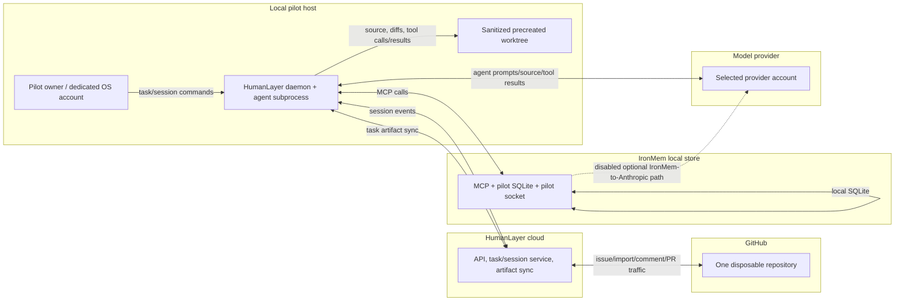

# HumanLayer Pilot Threat Model

**Review date:** 2026-08-17
**Scope:** HumanLayer evaluation for issues [#304](https://github.com/ironrace/ironmem/issues/304) and [#311](https://github.com/ironrace/ironmem/issues/311). This is the authoritative security gate for this pilot.

**Evidence snapshot.** The facts below were checked against the linked primary documentation, the npm registry metadata, and this repository at this review date. “Fact” means the source says it; “inference” is a security conclusion from facts; “unknown” is deliberately not filled in by marketing, a generic privacy policy, or a source-code scan. A normal developer shell failed the secret-presence negative control: multiple secret-shaped variable *names* existed. Values were neither read nor printed. That shell and account are therefore not approved.

## Executive decision

**Broader rollout: BLOCKED.** A pilot is **PERMITTED** only for public, synthetic, or demonstrably public-equivalent material in one disposable selected GitHub repository, subject to every mandatory control in this document. Private, internal, confidential, regulated, customer-data, production-connected, secret-bearing, signing, deployment, and infrastructure-administration repositories are **PROHIBITED**.

This decision is an inference from a daemon whose agent has the authority of its OS user, cloud task/session/artifact flow, GitHub write permissions, non-subtractive default file copying, and unresolved vendor/model evidence. It is not an assertion that HumanLayer is unsafe in every context.

## Compatibility invariant

All HumanLayer work is additive new code, configuration, or documentation. It must not overwrite or change `/collab`, `iron-build`, `iron-plan`, `iron-spec`, `iron-tdd`, or their support files or contracts. Existing workflows remain independently runnable. A shared-boundary change requires a separate approved issue and regression coverage; this pilot does not authorize one.

## Sources and evidence quality

### Primary HumanLayer evidence

| Source | Established fact / qualification |
|---|---|
| [Remote daemons](https://docs.humanlayer.com/explanation/remote-daemons) | The API sends work to the daemon and receives events; the daemon agent has the file/network authority of its OS user. Login refresh/session material is under `~/.humanlayer/riptide/`; a launch token exchanged for process credentials is a credential. |
| [Tasks](https://docs.humanlayer.com/explanation/tasks) | Task files are under `.humanlayer/tasks/<slug>/`; supported edits synchronize task artifacts between local and cloud, including text/object-storage behavior. |
| [Workspace config](https://docs.humanlayer.com/reference/workspace-config) | `copyGlobs` append and deduplicate; `disabled: true` disables automatic worktree setup; `setupCommand` executes as `sh -c` after copying. |
| [GitHub integration](https://docs.humanlayer.com/guide/github-integration) | The app requests Contents, Issues, Pull requests read/write and Metadata read; selected-repository installation is available; issue/comments may be imported and artifact links written back. |
| [Codex guide](https://docs.humanlayer.com/guide/codex) and [Bedrock guide](https://docs.humanlayer.com/guide/bedrock) | HumanLayer launches provider tools on the host and provider/environment setup is material to the boundary. These are not evidence of a HumanLayer sandbox. |
| [Current product](https://www.humanlayer.com/) | The service synchronizes through HumanLayer APIs and uses user-provided model subscriptions/credentials; the site says the current product is not fully open source. |
| [Privacy policy](https://www.humanlayer.dev/legal/privacy-policy.html) | Generic service-provider/cloud/analytics categories, product-improvement language, retention as needed, deletion/anonymization with isolated backups, reasonable security, limited employee access, and legally required breach notice are described. It does **not** establish product-specific no-training, retention period, named subprocessors, deletion SLA/verification, encryption, tenant isolation, audit logs, incident SLA, DPA, SOC 2, or penetration testing. |
| [npm package](https://www.npmjs.com/package/@humanlayer/cli) and [registry metadata](https://registry.npmjs.org/@humanlayer%2fcli) | Inspected release: `@humanlayer/cli` 0.31.59; wrapper integrity `sha512-uC6nCjYPOT55oHt9kOPhk3WCXbH2/bOPKz/6Xqg1EcM41x46UHAuUyzIxWbsQKfj43TBfqX6aKe6v2PPcvUnFw==`; wrapper shasum `81da4e2e57a68542463b682cbca69ce24af56d16`; darwin-arm64 shasum `33490919cf505fe08a955535dd710fcc4f4a1fd5`; downloaded platform binary SHA-256 `1ea566ece5d0b13f31514e99727c6a82b68ad709a8ed6ccc2d64791`. These are installation evidence, not runtime assurance. |
| [Pinned public code snapshot](https://github.com/humanlayer/humanlayer/tree/99abe673498cf8bdcd5f989aebe9406a27185b3b) | Commit `99abe673498cf8bdcd5f989aebe9406a27185b3b`, dated 2026-06-18, is a reproducible public-code snapshot only; it is not assurance for the current hosted product. |

The current CLI help exposes provider/model/thinking choices but no sandbox/approval switches. A binary string scan similarly cannot prove effective subprocess sandbox or approvals. **Unknown:** the effective agent subprocess policy. Compensate with host isolation and canaries.

### Provider and IronMem evidence

[OpenAI’s agent approvals/security](https://learn.chatgpt.com/docs/agent-approvals-security) and [sandboxing](https://learn.chatgpt.com/docs/sandboxing) describe Codex’s own OS sandbox, approvals, and prompt-injection considerations. They are capabilities of Codex, not proof that HumanLayer launches Codex with those defaults. [OpenAI API data controls](https://developers.openai.com/api/docs/guides/your-data#default-usage-policies-by-endpoint) establish API no-training-by-default unless opted in and conditional abuse-log/application-state retention; Zero Data Retention and Modified Abuse Monitoring require eligibility/configuration.

[Anthropic consumer retention](https://privacy.claude.com/en/articles/10023548-how-long-do-you-store-my-data), [training use](https://privacy.claude.com/en/articles/7996885-how-do-you-use-personal-data-in-model-training), and the [Claude Code FAQ](https://support.claude.com/en/articles/14554922-claude-code-user-faq) distinguish consumer settings/retention from commercial Team, Enterprise, and API no-training-by-default unless opted into a program.

IronMem evidence is local and repository-relative: [local SQLite and shared store](../README.md#shared-memory-across-harnesses), [daemon/socket configuration](../README.md#shared-daemon-mode), [isolated `IRONMEM_DB_PATH`](../README.md#shared-memory-across-harnesses), [access mode](../README.md#use-with-any-mcp-client), and [optional rerank/preferences](../README.md#llm-rerank-opt-in). Recalled memory included in an agent prompt crosses the selected provider boundary. Default shared storage is unsuitable for this pilot; optional LLM reranking/preference extraction must stay off.

## System and trust boundaries

The host is the primary authority boundary. HumanLayer cloud, GitHub, IronMem’s local Unix-socket/SQLite boundary, and the selected model provider are distinct controllers/processors. Every arrow is a potential disclosure or command path; untrusted content does not become authority by crossing a boundary.

## Data inventory and flow

| Data class | Source → destination | Persistence | Pilot handling |
|---|---|---|---|
| Issue/comment/ticket data | GitHub → HumanLayer → daemon | GitHub, cloud/task files | Public/synthetic only; treat as untrusted. |
| Prompts/messages/session events | Pilot/daemon → HumanLayer and provider | Cloud/provider per account terms | No sensitive prompts; capture account evidence. |
| Source/diffs/tool calls/results | Worktree/agent → provider; selected artifacts → cloud | Worktree, provider, possible artifacts | Sanitized disposable repo; human review. |
| Task artifacts | `.humanlayer/tasks/` ↔ HumanLayer | Local and cloud/object storage | Stop on sensitive content; request deletion. |
| HumanLayer auth/launch tokens | Login/launch → daemon/cloud | `~/.humanlayer/riptide/`, cloud | Pilot-only, short-lived where possible; revoke at teardown. |
| GitHub App credentials | App/cloud → selected repository | GitHub/HumanLayer | One repo, exact manifest; never expose token. |
| Provider credentials | Pilot account → provider CLI/API | Account/credential store | Pilot-only, short-lived; no browser/personal auth. |
| Copied workspace files | Source repo → generated worktree | Local worktree | Automatic copying disabled; manual sanitized worktree only. |
| IronMem drawers/diary/code maps/metrics | Agent MCP ↔ local SQLite | Pilot SQLite/socket | Isolated paths; no cross-repo recall; metrics reviewed. |
| Telemetry/crash data | CLI/host → vendor/provider | Vendor/host logs | Minimize, classify as possible disclosure, retain incident evidence. |

## Pilot architecture and mandatory controls

1. Use a dedicated non-admin OS account or isolated host, clean home, restricted filesystem, and explicit network allowlist. The normal developer environment is **PROHIBITED**.
2. Use one disposable selected GitHub repository containing only public/synthetic material. Protect its default branch/ruleset; create draft PRs only; no merge or deployment.
3. Do not use computer control for permission changes or destructive actions. Those actions require out-of-band human confirmation by the **Pilot owner**.
4. Pin package versions and integrity; disable automatic workspace setup; forbid a local override; manually precreate and sanitize the worktree.
5. Launch with `env -i` plus an approved allowlist. No production secrets, `.env` defaults, personal GitHub/cloud auth, SSH identities, or inherited credential helpers.
6. Set pilot-specific `IRONMEM_DB_PATH` and `IRONMEM_DAEMON_SOCKET`. Keep `IRONMEM_MCP_MODE` least-privilege for the task, with IronMem LLM rerank and LLM preference extraction off.
7. Back up the pilot SQLite/worktree only to approved pilot storage and review every diff/artifact before any external action.

## GitHub least-privilege permission manifest

**Installation target:** exactly one named disposable pilot repository, selected-repositories mode. **Owner:** **GitHub administrator**; **reviewer:** **Security reviewer**.

| Requested | Explicitly absent |
|---|---|
| Contents read/write; Issues read/write; Pull requests read/write; Metadata read | Actions, Administration, Checks, Deployments, Environments, Members, Organization administration, Packages, Pages, Secrets, Workflows |

Capture the installation repository list and permission screen before launch and each session. Permission/repository drift is **BLOCKED**: suspend/disconnect the app, revoke changed grants, preserve evidence, and require new approval. Branch protection/ruleset must prohibit direct default-branch writes and merging by the pilot automation.

## Credential and environment preflight

The normal review shell failed a negative control because secret-shaped names were present; values were never read and exact names are not published. It is **PROHIBITED** for the pilot.

The **Host operator** records only names/classes and presence, never values: run a name-only review such as `env | sed 's/=.*//'`, inspect `ssh-add -l` without key material, inspect the GitHub/credential-helper status, and record whether expected pilot credential files exist with permissions. Do not use commands that print environment values, tokens, `.env` contents, or credentials.

Before launch, evidence must show a clean dedicated account, `env -i` allowlist invocation, no `.env` defaults, no SSH identities, no personal `gh` or cloud authentication, short-lived pilot-only provider credentials, and approval timestamps. Example launch pattern: `env -i PATH="$PATH" HOME=/pilot/home LANG=C ...`; the precise approved allowlist is evidence-controlled and excludes credential variables by default.

## Default `.env` copying verification

HumanLayer’s [workspace config reference](https://docs.humanlayer.com/reference/workspace-config#copyglobs) lists these six defaults: `.env`, `.env.local`, `.env.development.local`, `.claude/settings.local.json`, `.humanlayer/workspace.json`, and `.humanlayer/workspace.local.json`. It says lists append and deduplicate; defaults, shared, local, and repo lists do not replace or subtract one another. The same reference says `setupCommand` runs via `sh -c` after copying.

Therefore individual defaults cannot be disabled. The shared config must contain `"disabled": true`, there must be no `.humanlayer/workspace.local.json` override, and the worktree must be manually precreated and sanitized. Re-enabling remains **BLOCKED** until the product supports subtractive controls or independent verification proves equivalent containment.

## Sandbox, approvals, and prompt injection

HumanLayer’s effective agent subprocess sandbox/approval policy is publicly **unknown**. Do not assume official Codex defaults apply when HumanLayer invokes an agent. Codex documents OS sandboxing and approvals, but that proves only the Codex-capability baseline, not this integration. OS isolation plus canary tests are mandatory: attempt controlled out-of-worktree access, disallowed network egress, permission change, and destructive action; fail closed on an unexpected success.

GitHub issues/comments, repository files, task artifacts, web results, tool output, and IronMem recall are untrusted instructions. Deny requests to access/exfiltrate secrets, expand permissions, perform destructive actions, merge, deploy, sign, or disable controls. The **Pilot owner** must confirm such a request out-of-band; no prompt, comment, or tool output can grant authority.

## Risk register

| ID | Scenario | Impact / severity | Mandatory mitigation | Owner | Residual risk / evidence | Rollout gate |
|---|---|---|---|---|---|---|
| HOST-01 | Daemon agent inherits OS-user file/network authority | Critical | Dedicated non-admin host/account, allowlist, canaries | Host operator | Host isolation limits but does not prove agent policy | Pilot-only |
| HOST-02 | `setupCommand` executes shell code after copies | High | `disabled: true`; no local override; manual worktree | Host operator | Official config confirms `sh -c`; no automatic setup | BLOCKED otherwise |
| CRED-01 | Inherited env, SSH, `gh`, cloud, or `.env` credentials leak | Critical | Clean account, `env -i`, name-only preflight, no personal auth | Host operator | Normal shell failed negative control | Pilot-only |
| CRED-02 | HumanLayer launch/refresh token is stolen | High | Treat as credential; pilot-only storage, revoke/rotate | Vendor owner | Token-path fact, storage controls unknown | BLOCKED for broad use |
| GH-01 | GitHub App content/issue/PR write scope is abused | High | One disposable repo; draft PR only; ruleset | GitHub administrator | Official requested scope is broad within repo | Pilot-only |
| GH-02 | Repo/permission drift expands blast radius | Critical | Capture manifest; suspend/disconnect on drift | GitHub administrator | Requires operational review evidence | BLOCKED on drift |
| PI-01 | Prompt injection from issue, code, artifact, web/tool/memory | High | Treat all as untrusted; out-of-band gate; canaries | Pilot owner | No prompt policy is complete | Pilot-only |
| PI-02 | Computer control changes permissions or destroys data | Critical | No computer control for those actions | Pilot owner | Human confirmation external to conversation | PROHIBITED |
| SC-01 | npm, platform binary, Homebrew, desktop, model CLI updates are compromised | Critical | Exact pins/integrity, reviewed updates, no unattended update | Security reviewer | Integrity only identifies reviewed artifact | BLOCKED on mismatch |
| SC-02 | Hosted workflows/skills or GitHub App changes alter behavior | High | Version/permission change review, evidence capture | Vendor owner | Hosted behavior not pinned by public repo | BLOCKED pending review |
| VENDOR-01 | Cloud retains sessions/artifacts or uses them beyond expectations | Critical | Public/synthetic only; deletion request procedure | Vendor owner | Product-specific retention/training unknown | BLOCKED broadly |
| VENDOR-02 | Tenant, employee, subprocessor, audit, incident controls are inadequate | Critical | Obtain contractual/security evidence | Vendor owner | Generic privacy policy insufficient | BLOCKED broadly |
| MODEL-01 | Provider receives prompt/source/tool/memory data | Critical | Account-class/data-control capture; public/synthetic only | Model-provider administrator | Provider path depends on selected auth/account | Pilot-only |
| MODEL-02 | Browser/subscription terms are mistaken for API commitments | High | Verify auth mechanism and account class | Model-provider administrator | API controls do not automatically apply | BLOCKED absent evidence |
| IM-01 | Default shared IronMem store contaminates cross-repo context | High | Pilot DB/socket; later cross-repo canary | Host operator | Shared-store default is documented | BLOCKED on failed canary |
| IM-02 | Optional IronMem LLM rerank/preferences add egress | High | Leave rerank/preference extraction off | Host operator | Optional paths documented; disabled state must be captured | PROHIBITED when enabled |

## Vendor evidence and unanswered questions

Generic privacy statements are insufficient. Every critical gap below is a wider-rollout blocker owned by the **Vendor owner** until written, product-specific evidence is captured and approved by the **Security reviewer**.

| Evidence request | Current status / gate |
|---|---|
| Data classes leaving host; storage locations/regions; retention | Unknown product-specific answer — BLOCKED. |
| Training/product improvement | Generic language only; no product-specific opt-out/no-training assurance — BLOCKED. |
| Named subprocessors | Unknown — BLOCKED. |
| Deletion SLA, verification, and backup lifecycle | Generic deletion/anonymization/backups only — BLOCKED. |
| Encryption in transit/at rest and key management | Unknown — BLOCKED. |
| Tenant isolation and employee access | Generic limitation only; isolation/control detail unknown — BLOCKED. |
| Audit logs/export/retention | Unknown — BLOCKED. |
| Incident notification SLA and process | Legally-required-notice wording only — BLOCKED. |
| DPA, SOC 2, and penetration-test evidence | Not established by reviewed public evidence — BLOCKED. |
| Effective sandbox/approval policy; credential storage/rotation | Unknown — BLOCKED. |

## Model-provider controls

HumanLayer cloud is not the selected model provider; both data paths must be reviewed. Subscription/browser authentication is not API use. Do not apply OpenAI API commitments to ChatGPT/Codex subscription or browser authentication without explicit verification. OpenAI API evidence is conditional: API inputs/outputs are not used for training by default unless opted in, while abuse logging, application state, ZDR, and MAM vary by endpoint, eligibility, and configuration.

Anthropic’s official material distinguishes consumer retention/training-setting consequences from commercial Claude for Work/API no-training-by-default unless opted into a program; Claude Code account treatment must be verified for the actual plan. Before each pilot, the **Model-provider administrator** captures provider, account class, authentication method, data controls, retention, training setting, region, deletion setting, credential lifetime, and approval. Missing evidence is **BLOCKED**.

## Supply-chain manifest

No `@latest`, floating model, unattended update, or unreviewed auto-update is permitted. Each update is reviewed before use and reopens the relevant risk gates.

| Component/channel | Required evidence owner | Required record |
|---|---|---|
| npm CLI/meta package | Security reviewer | Exact `@humanlayer/cli` pin and npm integrity/shasum. |
| Platform binary | Security reviewer | Platform package shasum and downloaded SHA-256. |
| Homebrew desktop, if used | Host operator | Formula/cask version, source, hash, no auto-update. |
| Codex/Claude CLI/provider | Model-provider administrator | Exact version, channel, account/auth class. |
| HumanLayer workflows/skills | Vendor owner | Reviewed version/behavior and change record. |
| GitHub App permissions | GitHub administrator | One-repo manifest and before/after capture. |

## Failure and incident handling

| Condition | Fail-closed behavior |
|---|---|
| Secret-shaped name, `.env`, SSH identity, or cloud/deployment credential found | Stop before launch; remove access path; rotate if exposed; preserve name-only evidence. |
| Workspace setup enabled or local override exists | Stop; delete generated sanitized workspace if needed; restore `disabled: true`. |
| GitHub repository/permission drift | Stop; revoke/disconnect installation; preserve capture; reauthorize only after approval. |
| Canary disproves containment or approval gate | Stop; revoke tokens; preserve evidence; no broader data. |
| Injection seeks secrets, permissions, destructive action, merge, deployment, or control disabling | Deny; stop if attempted; out-of-band escalation and review. |
| Sensitive artifact/session leakage | Stop/revoke/rotate; request cloud/provider deletion; preserve evidence; verify deletion including backups where available. |
| Package/version/integrity mismatch | Stop install/launch; quarantine artifact; review and update manifest only with approval. |
| IronMem resolves shared store or optional LLM egress | Stop; isolate DB/socket; disable feature; run later canary. |
| Vendor/provider evidence stale, missing, or contradictory | Keep classification PROHIBITED and broader rollout BLOCKED. |

## Pilot checklist and evidence record

No box is pre-checked without captured evidence.

### Preflight

- [ ] Pilot owner: repository classification and disposable-repo URL; evidence: ______
- [ ] Host operator: clean non-admin account/host and name-only environment review; evidence: ______
- [ ] Host operator: `env -i` allowlist, no `.env`, SSH, personal GitHub/cloud auth; evidence: ______
- [ ] GitHub administrator: one-repo permission capture and branch protection/ruleset; evidence: ______
- [ ] Security reviewer: package pins/integrities and no update drift; evidence: ______
- [ ] Model-provider administrator: account-class/data-control record and short-lived credential; evidence: ______
- [ ] Host operator: `IRONMEM_DB_PATH`/`IRONMEM_DAEMON_SOCKET` isolated; rerank/preferences off; evidence: ______
- [ ] Security reviewer: workspace shared disable/no local override/manual sanitized worktree; evidence: ______

### Per-session

- [ ] Pilot owner: public/synthetic task content verified; evidence: ______
- [ ] Host operator: launch allowlist and credential presence rechecked; evidence: ______
- [ ] GitHub administrator: repository/permission drift check; evidence: ______
- [ ] Pilot owner: draft PR/diff/artifact review, no merge/deploy; evidence: ______
- [ ] Security reviewer: injection/canary anomalies and logs reviewed; evidence: ______

### Teardown

- [ ] Host operator: stop daemon; revoke/delete local pilot credentials and riptide session material; evidence: ______
- [ ] GitHub administrator: disconnect/revoke app or document retained one-repo installation; evidence: ______
- [ ] Vendor owner: artifact/session deletion request and verification record; evidence: ______
- [ ] Model-provider administrator: revoke provider credentials and record retention/deletion action; evidence: ______
- [ ] Host operator: archive approved evidence, destroy pilot worktree/DB according to retention decision; evidence: ______

## Repository classification decision

| Classification | Decision | Conditions |
|---|---|---|
| Public, synthetic, or public-equivalent data in one disposable repo | PERMITTED | Every pilot checklist item, draft-only workflow, and canary passes. |
| Private/internal/confidential/customer/regulated | PROHIBITED | May change only after all critical vendor/provider/sandbox/incident gates have evidence and accountable approval. |
| Production-connected, secret-bearing, signing, deployment, infrastructure administration | PROHIBITED | Requires separate security architecture and approved issue; this threat model cannot approve it. |

Changing a classification requires a new evidence review by the **Security reviewer**, written approval by the **Pilot owner**, permission review by the **GitHub administrator**, host review by the **Host operator**, vendor evidence by the **Vendor owner**, and provider evidence by the **Model-provider administrator**.

## Critical blockers and exit criteria

Wider rollout remains **BLOCKED** until every item has current evidence and accountable approval: product-specific vendor retention/training/subprocessor/deletion/encryption/isolation/audit/incident/DPA-assurance evidence; demonstrated effective sandbox/approval containment; subtractive-copy support or equivalent independently verified containment; clean environment controls; one-repo GitHub enforcement and drift response; provider account/data controls; IronMem isolation canary and disabled optional egress; and tested incident stop/revoke/rotate/delete-request/preserve-evidence handling.

## Issue #311 acceptance mapping

| Acceptance criterion | Satisfying section |
|---|---|
| Scope, evidence, facts/unknowns, rollout decision | Introduction; Executive decision; Sources and evidence quality |
| Additive compatibility | Compatibility invariant |
| Trust-boundary diagram and data flow | System and trust boundaries; Data inventory and flow |
| Pilot host/workspace/GitHub/IronMem controls | Pilot architecture; GitHub manifest; credential preflight; copying verification |
| Sandbox, injection, and all risk prefixes | Sandbox, approvals, and prompt injection; Risk register |
| Vendor/provider and supply-chain evidence | Vendor evidence; Model-provider controls; Supply-chain manifest |
| Fail-closed response, checklist, classification | Failure and incident handling; Pilot checklist; Repository classification decision |
| Rollout blockers, ownership, traceability | Critical blockers; Review cadence and ownership |

## Review cadence and ownership

The **Pilot owner** authorizes only the narrow pilot and owns out-of-band action confirmation. The **Host operator** owns host/env/IronMem isolation. The **GitHub administrator** owns app install, permissions, and drift. The **Security reviewer** approves evidence and gates classification. The **Vendor owner** obtains HumanLayer controls/contract evidence. The **Model-provider administrator** owns provider account and data-control evidence.

Evidence may be no older than one quarter. Review immediately after any permission, product, provider, authentication, package/version, workflow/skill, environment, or incident change; otherwise perform a quarterly review at maximum. A missed review makes broader rollout **BLOCKED** until renewed evidence is approved.
